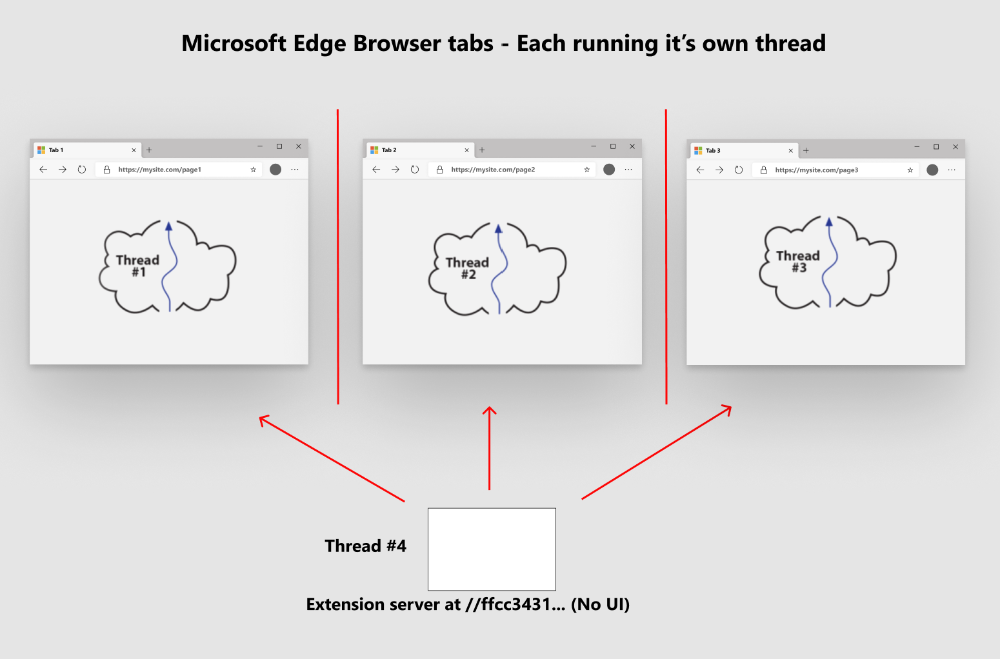

# Introducción a las extensiones de Microsoft Edge \ (cromo \)  

Si desea ir directamente a la creación de la primera extensión, vaya a la parte 1 de la creación de una imagen de NASA de la extensión de día.  

Si no está familiarizado con los conceptos y la arquitectura de extensión, continúe leyendo y obtenga información sobre qué son las extensiones.  Esta información te ayuda a compilar extensiones mucho más fácilmente porque comprendes las motivaciones y la arquitectura que las sustentamos.  

## Crear una imagen de NASA con la extensión de día  

Cada sección tiene el paquete de instalación de origen de extensión completado al que se hace referencia en él.  

*   [Crear una extensión simple que emerja la imagen de la NASA](part1-simple-extension.md)  
    *   Crear un manifiesto  
    *   Asignar iconos de extensión  
    *   Mostrar una ventana emergente  
    *   Ejecuta tu extensión localmente en tu explorador \ (carga de carga \)  

*   [Insertar dinámicamente la imagen de la NASA debajo de la etiqueta cuerpo de la página](part2-content-scripts.md)  
    *   Crear JavaScript que inserte script de contenido dinámico  
    *   Definir en el manifiesto qué páginas obtienen script de contenido  
    *   Insertar script de contenido de forma declarativa  
    *   Agregar un botón en la ventana emergente para enviar un mensaje a una secuencia de comandos de contenido  
    *   Recibir un mensaje dentro de un script de contenido  

## Comprender el explorador antes de que se introduzcan las extensiones  

### Cada pestaña del explorador está aislada de cada una de las pestañas  

Para entender qué es una extensión de Microsoft Edge \ (cromo \), debemos comprender en primer lugar lo que hace un explorador de varias pestañas, como Microsoft Edge.  Para empezar, cada pestaña del explorador se ejecuta en un subproceso individual que la aísla de forma eficaz de otras pestañas del explorador \ (o subprocesos \).  

  

### Cada pestaña administra una solicitud GET  

Cada pestaña usa esencialmente la dirección URL \ (también conocida como localizador de recursos uniforme \) para obtener una única secuencia de datos, que normalmente es un documento HTML.  Esa secuencia única \ (o página \), a menudo incluye instrucciones \ (como las etiquetas de inclusión de JavaScript, referencias de imagen, referencias de CSS y más \).  En última instancia, todos los recursos necesarios se descargan en una página de pestaña y, generalmente, aparece una visualización que vemos en la pestaña del explorador representada por completo.  

### Toda la comunicación de cada pestaña es a los servidores remotos  

Comprender que cada pestaña se ejecuta en un entorno aislado significa que estas pestañas están aisladas entre sí, pero no la mayor Internet.  Normalmente, estas pestañas, que ejecutan JavaScript como el lenguaje de programación definido, se comunican con el servidor, que debe considerarse como el servidor de origen de la primera solicitud GET que se especificó en la barra de direcciones URL en la parte superior de la pestaña del explorador.  

## El modelo de extensión desactiva todo hacia arriba  

Una extensión, al igual que las páginas de pestañas, se ejecuta en un subproceso individual que está completamente aislado de todos los subprocesos de la página de pestañas que se tratan.  A diferencia de las pestañas cuyo trabajo suele emitir una única solicitud GET a un servidor remoto, se muestra una visualización de esos datos en el explorador, la extensión, por otra parte, es el servidor, que residía en el otro extremo de la conexión a Internet realizada desde una ficha del explorador.  

  

Es muy importante entenderlo.  Una vez que haya creado una extensión e instálela en el explorador, habrá creado un servidor web independiente que vive y se respire dentro de su explorador, pero que sigue aislado de cada página de pestaña que se ejecuta en ese explorador.  

### El paquete de servidor Web de extensión  

Entonces, ¿qué es una extensión? Es un paquete \ (o conocido como archivo zip \) de recursos web que no difieren de lo que un desarrollador web publica en un servidor Web.  

Ese archivo zip incluye HTML, CSS, JavaScript, imágenes y todos los activos necesarios para crear una página web.  Sin embargo, hay un archivo adicional que se requiere en la raíz de este archivo zip y ese archivo se denomina `manifest.json` .  Es el Blueprint de la extensión que incluye cosas como qué es la versión de la extensión, qué es el título, qué privilegios necesita ejecutar y mucho más.  

  

### Iniciar el servidor de extensiones  

Al implementar en un servidor Web, ese servidor Web, ya sea Apache, IIS, NGINX o cualquier otro, contiene su paquete Web.  Cuando un explorador navega a una dirección URL en un servidor, `index.html` se descarga el archivo en el servidor Web.  El explorador navegó con certificados, archivos de configuración, etc.  El `index.html` archivo se almacena en una ubicación especial en el servidor Web.   ¿Cómo hace la extensión la misma cosa?  En concreto, ¿cuál es la página de ficha de su explorador capaz de acceder a este archivo zip \ (extensión \)?  Eso es lo que hace el tiempo de ejecución de la extensión.  

La extensión da servicio a los archivos de la dirección URL \ (localizador de recursos uniforme \) en el nombre `extension://{some-long-unique-identifier}/index.html` .  El nombre que pongo entre corchetes `{some-long-unique-identifier}` es un identificador único que se asigna a la extensión que ha instalado.  Esto significa que si tiene 10 extensiones únicas instaladas en su explorador, cada extensión tiene un identificador único que señala al archivo zip \ (o paquete de extensión \) instalado en el explorador.  

<!--  -->  

<!--todo: add image for unique URLs  -->  

### Las extensiones se administran y se comunican con fichas y la barra de herramientas del explorador  

Las extensiones interactúan con la barra de herramientas del explorador, por lo que cada una puede administrar todas las demás páginas de pestañas en ejecución de forma segura, así como manipular el DOM de todas esas páginas de pestaña.  Incorporado en el explorador de cromo es una API de mensaje que permite que las comunicaciones entre las extensiones y las páginas de fichas permitan que esto suceda correctamente.  Esta API, también conocida como API de extensiones, ofrece una gran cantidad de funciones, como la administración de notificaciones, la administración del almacenamiento y mucho más.  

Al igual que los servidores Web, las extensiones pueden ejecutar continuamente \ (o suspender la espera de notificaciones \) todo el tiempo que se ejecuta el explorador.  Puede pensar en una extensión como un Orchestrator para el explorador.  Una vez más, la extensión se ejecuta completamente aislada de las páginas de pestaña, pero a través de la API de extensiones y permisos de participación otorgados a la extensión, cada extensión puede controlar prácticamente todas las páginas de pestaña que se ejecutan en el explorador.  

### Las extensiones proporcionan una participación en el modelo de seguridad del momento de la instalación  

Cada extensión, a través de una declaración en el `manifest.json` archivo, permite que la persona que la instala se asigne a diferentes niveles de autoridad.  Esta autoridad permite que las extensiones, cuando las instala un usuario, se participen para que la extensión pueda extraer cualquier tipo de información y procesar los datos a través de la extensión.  

<!-- image links -->  

<!-- links -->  
