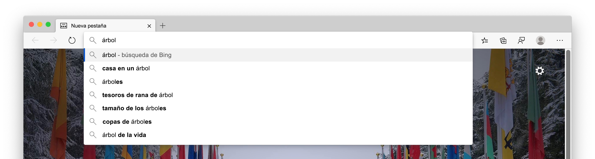
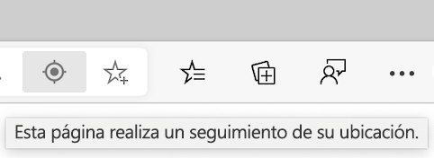
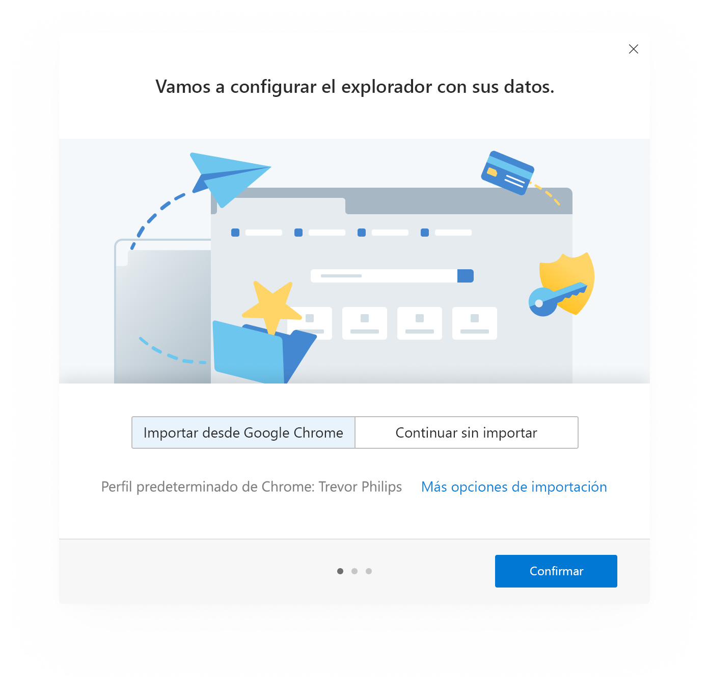
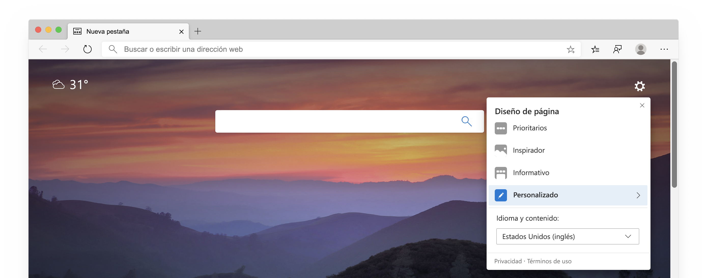
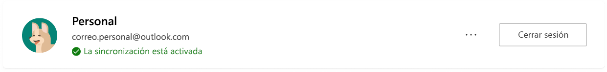
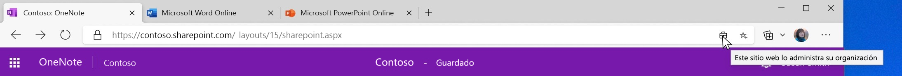

# notas del producto sobre la privacidad de Microsoft Edge  

La promesa de privacidad de nuestro navegador es proporcionarle la protección, la transparencia, el control y el respeto que usted merece.  Para mantenerle compromisos que le proporcionen transparencia en los productos de Microsoft, el equipo de Microsoft Edge proporcionó un informe detallado sobre privacidad que explica cómo funcionan las características y los servicios de Microsoft Edge y cómo cada uno puede afectar a su privacidad.  El objetivo del equipo de Microsoft Edge es proporcionarle una comprensión completa de cómo se usan sus datos, cómo controlar las distintas características y cómo administrar los datos recopilados, para que tenga la información que necesita para tomar las decisiones de privacidad adecuadas para usted.  

En determinadas secciones del documento, el equipo de Microsoft proporciona pasos para ir a la configuración de Microsoft Edge y a otras páginas.  Por coherencia, el equipo de Microsoft Edge usó un formato abreviado en el libro de notas: debe ver las direcciones `edge://` URL que `edge://favorites` comienzan `edge://settings/privacy`con, como o.  Para ir a las páginas, escriba el texto en negrita directamente en la barra de direcciones de Microsoft Edge.  Estas páginas solo se pueden ver en Microsoft Edge.  

El libro de notas se centra en la versión de escritorio de Microsoft Edge y partes del papel pueden incluir características o experiencias que no están disponibles para todos los usuarios.  Además, el artículo técnico analiza las características y servicios que existen en el producto hoy, pero puede estar sujeto a cambios en el futuro.  La minimización de la recopilación de datos de prácticas de Microsoft, lo que significa que los datos se guardan por la cantidad mínima de tiempo, pero los tiempos de retención pueden variar según la característica o el servicio que se use y pueden cambiar a lo largo del tiempo.  

## Barra de direcciones y sugerencias  

La barra de direcciones le permite especificar direcciones URL de sitios web y buscar en la Web.  De forma predeterminada, la barra de direcciones proporciona una búsqueda y sugerencias de sitio usando los caracteres que escriba.  Debería ver sugerencias de sus favoritos, el historial de exploración, las búsquedas anteriores y el proveedor de búsquedas predeterminado.  

  

Para que la exploración y la búsqueda sean más rápidas, a medida que escribe en la barra de direcciones, los caracteres con tipo se envían a su proveedor de búsqueda predeterminado para que el proveedor de búsqueda envíe consultas de búsqueda sugeridas.  La barra de direcciones clasifica la entrada como una dirección URL, una búsqueda o Unknown (desconocida).  Esta información, junto con la que seleccione, la posición de la selección y otros datos de la barra de direcciones se envían a su proveedor de búsqueda predeterminado.  Si el proveedor de búsqueda es Bing, se envía un identificador redefinitivo único para el explorador con estos datos para comprender la consulta de búsqueda y la sesión de consulta.  Otros identificadores de servicio de autosugerir se envían a su motor de búsqueda predeterminado para completar las sugerencias de búsqueda.  La dirección IP y las cookies se envían a su proveedor de búsquedas predeterminado para aumentar la relevancia de los resultados de la búsqueda.  Cuando selecciona la barra de direcciones, se envía una señal a su proveedor de búsqueda predeterminado para indicar al proveedor que prepárese para proporcionar sugerencias.  Los caracteres con tipo y las consultas de búsqueda no se envían a Microsoft a menos que el proveedor de búsqueda sea Bing.  Estos datos solo se envían a su proveedor de búsqueda predeterminado si tiene activada la opción **mostrarme las sugerencias de búsqueda y de sitio con los caracteres escritas** .  Si desactiva esta característica, los caracteres que escriba no se enviarán al proveedor de búsqueda predeterminado.  Las consultas de búsqueda siguen enviándose a su proveedor de búsqueda predeterminado para proporcionar resultados de búsqueda.  Si Microsoft Edge detecta que su escritura en la barra de direcciones puede contener información confidencial, como credenciales de autenticación, nombres de archivo locales o datos de dirección URL que normalmente están cifrados, no envía el texto escrito.  Si tiene más **mejoras en los productos de Microsoft enviando informes de bloqueo y datos sobre cómo usa la configuración del explorador** activada, Microsoft Edge recopila datos de diagnóstico acerca de la barra de direcciones, como el número de consultas ofrecidas, con independencia de su proveedor de búsqueda.  

Las pulsaciones de teclas y los sitios web que visita se almacenan localmente en el dispositivo por perfil.  Puede eliminar estos datos en `edge://settings/clearBrowserData`, activando la casilla de verificación del historial de **exploración**y seleccionando **Borrar ahora**.  Si Bing es su proveedor de búsquedas predeterminado y ha iniciado sesión en Bing, puede eliminar las búsquedas en el [Microsoft Privacy Dashboard](https://account.microsoft.com/account/privacy?ref=privacy-edge-browse&ru=https%3A%2F%2Faccount.microsoft.com%2Fprivacy%2Fbrowse%3Fref%3Dprivacy-edge-browse&destrt=privacy-dashboard).  Puede borrar el historial de `edge://history` exploración para eliminar esos sitios web para que no aparezcan como sugerencias en la barra de direcciones.  En Windows 10, puede borrar los datos que Microsoft recopila de la barra de direcciones y las características de sugerencias de búsqueda **yendo a** > **configuración** > **de privacidad** > **diagnósticos \ & comentarios**y seleccionando **eliminar** en **eliminar datos de diagnóstico**.  Todos los demás datos se eliminan después de 36 meses.  

Si ha iniciado sesión en Microsoft Edge con una cuenta profesional o educativa de Microsoft y Microsoft Search está disponible, se envía un token anónima que representa su cuenta con la consulta para proporcionar funcionalidades específicas de la cuenta, como los resultados específicos de su empresa.  

Todos los datos se transmiten de manera segura a través de HTTPS.  Si [Bing](https://bing.com) es su proveedor de búsquedas predeterminado, las búsquedas y los caracteres de tipos se guardarán hasta 6 meses.  

Si busca una sola palabra en el cuadro Dirección, Microsoft Edge puede enviarla a su servidor DNS para ver si corresponde a un host de su red y puede intentar conectarse al host correspondiente en.  Esto le da la opción de navegar hasta ese host en lugar de buscar.  Por ejemplo, si el enrutador pasa por `router` el nombre de `router` host y escribe en la barra de direcciones, se le ofrecerá `https://router/`la opción de navegar a, así como buscar `router` la palabra con su proveedor de búsqueda predeterminado.  Esta característica no está controlada por la opción **mostrarme las sugerencias de búsqueda y de sitio con los caracteres con tipo** , ya que no implica enviar datos al motor de búsqueda predeterminado.  

Puede desactivar la opción **mostrarme las sugerencias de búsqueda y de sitio usando los caracteres con tipo** y cambiar el motor de búsqueda `edge://settings/search`predeterminado en.  Durante la exploración de InPrivate o en modo invitado, las sugerencias se desactivan.  InPrivate muestra sugerencias de navegación local, como el historial de exploración o las búsquedas anteriores, pero no se envía a su motor de búsqueda predeterminado.  El modo invitado no muestra sugerencias ni envía caracteres de tipo al motor de búsqueda predeterminado.  

Los datos recopilados por otros proveedores de búsqueda siguen la política de privacidad de su empresa.  

## Llenar  

Autorrellenar en Microsoft Edge le permite ser más productivo al permitirle guardar contraseñas, información de pago, direcciones y otros datos de entrada de formularios.  Cuando visita un sitio y comienza a rellenar un formulario, Microsoft Edge usa la información de relleno de formularios para que coincida con los datos de Autorrelleno guardados en el formulario.  Microsoft Edge ofrece los datos de las entradas de formularios que previamente guardó cuando se encuentren formularios similares.  Las contraseñas y la información de la tarjeta de crédito solo se guardan con su permiso explícito para cada contraseña y tarjeta.  

Las direcciones y otras entradas del formulario se guardan de forma predeterminada.  Sin embargo, puede desactivar el guardado y Autorrellenar de direcciones y otros datos del formulario `edge://settings/addresses`en.  

Evite que Microsoft Edge le pida que guarde las contraseñas desactivando la opción **oferta para guardar contraseñas** en `edge://settings/passwords`.  Si no desea que Microsoft Edge rellene las contraseñas guardadas existentes, puede eliminar las contraseñas guardadas `edge://settings/passwords` en para eliminar todos los datos de Autorrelleno, ir a la opción **Borrar datos de búsqueda** en la configuración de privacidad y servicios de Microsoft Edge.  Seleccione **Autorrellenar datos del formulario**, el intervalo de tiempo que desee y, a continuación, **Borrar ahora**.  

Si activó la sincronización de su perfil, los datos de Autorrellenar se sincronizarán en todas las versiones de Microsoft Edge donde haya iniciado sesión en las mismas credenciales.  Cuando la sincronización está activada, todos los datos de Autorrelleno se almacenan en servidores Microsoft cifrados.  Los datos de Autorrellenar almacenados en los servidores de Microsoft solo se usan para la sincronización.  Puede desactivar la sincronización de los datos de Autorrelleno en `edge://settings/profiles/sync`.  Si activó la sincronización para Autorrellenar, al eliminar los datos de Autorrellenar de un dispositivo en el que haya iniciado sesión en Microsoft Edge, se eliminarán los datos de Autorrelleno de otros dispositivos en los que haya iniciado sesión.  

Cuando visita una página web y envía un formulario, Microsoft Edge envía información sobre el formulario, como un hash de los tipos de entrada de nombre de host y Autorrellenar \ (por ejemplo, el cuadro 1 está buscando una dirección de correo electrónico, el cuadro 2 busca una contraseña, etc.) al servicio de relleno de formularios de Microsoft.  No se envía al servicio ningún identificador de usuario ni información introducida por el usuario.  Esta información ayuda a Microsoft Edge a identificar correctamente los formularios en diferentes páginas Web.  Estos datos se usan para ayudar a encontrar los datos de Autorrelleno guardados en el formulario.  

Cuando se usa el modo invitado, Autorrellenar no está disponible y no se agregan nuevas entradas de rellenado automático.  Al explorar InPrivate, Microsoft Edge ofrece entradas de Autorrelleno, pero no se agregan nuevas entradas de Autorrelleno.  

## Transmitir  

Cast en Microsoft Edge le permite mostrar sus elementos multimedia en otra pantalla con Google Cast.  Puede obtener acceso a esta característica desde **configuración y más (...)**  >  **Más herramientas** > **Cast multimedia para el dispositivo**.  Cast no usa los servicios de Microsoft o Google. 

## Colecciones  

Puede recopilar sitios, texto e imágenes en la web y organizar el contenido con colecciones en Microsoft Edge.  Todos los datos de las colecciones se almacenan localmente en el dispositivo y se organizan por Perfil de Microsoft Edge.  Si tiene activada la sincronización de las colecciones, las colecciones creadas, incluidas las notas o comentarios, estarán disponibles en todas las versiones de Microsoft Edge que tengan iniciada sesión y sincronizando.  

Cada 24 horas, Microsoft Edge descarga una lista de sitios admitidos para los que existen plantillas especiales de extracción de entidades.  Las plantillas son específicas de cada sitio Web.  Al crear un nuevo elemento en la colección, Microsoft Edge comprueba que el sitio desde el que está creando el nuevo elemento de colección se encuentra en la lista de sitios admitidos.  Si el sitio está en la lista, Microsoft Edge hace ping al servicio de extracción de entidades para la plantilla de sitios específicos.  No hay identificadores de usuario asociados a esta solicitud en el servicio.  Esta plantilla intenta identificar el nombre, el precio, las clasificaciones, la imagen principal y otros datos sobre el elemento que se va a recopilar.  Si el sitio desde el que está creando un nuevo elemento de colección no se encuentra en el sitio de lista admitido, Microsoft Edge no descarga una plantilla.  Las plantillas permiten que todos los elementos de la colección se creen de forma local en el dispositivo.  No se envían datos sobre los elementos de la colección al servicio para crear la colección.  

Las plantillas almacenadas en el dispositivo se pueden eliminar borrando los datos de la caché en la opción **Borrar datos de búsqueda** en `edge://settings/privacy`.  

Las colecciones no están disponibles al usar el modo de invitado o exploración de InPrivate.  

## Se bloquea  

Si se activan datos de diagnóstico opcionales, incluidos los informes de bloqueo, Microsoft recopila datos de diagnóstico cuando Microsoft Edge se bloquea o detecta otros problemas de confiabilidad.  Estos datos de diagnóstico se usan para diagnosticar y solucionar problemas de confiabilidad de Microsoft Edge y otros productos y servicios de Microsoft.  

  

Los datos de diagnóstico recopilados están en forma de volcados de sucesos, que contienen el estado del dispositivo y del software capturado en el momento en que Microsoft Edge encontró el problema de confiabilidad.  El volcado de bloqueo contiene información sobre lo que se estaba produciendo en el momento del problema de confiabilidad.  Puede incluir información como el sitio web que visita en el momento del bloqueo o el uso de la CPU en los datos de diagnóstico.  Los datos de diagnóstico de bloqueo se almacenan localmente en el dispositivo y se envían a Microsoft a través de un vínculo cifrado cuando el informe de bloqueo está activado.  Cada volcado de bloqueo contiene un identificador único para su dispositivo, un identificador redefinible único para el explorador y datos de diagnóstico adicionales \ (como la dirección URL, el uso de la CPU y el uso de la red \) para ayudar a identificar el problema.  Estos datos de diagnóstico adicionales se adjuntan al volcado de bloqueo para ayudar a diagnosticar el problema de confiabilidad, como la comprensión de Cuántos dispositivos están experimentando el problema y la gravedad.  

Los volcados de sucesos se envían a Microsoft y se almacenan en servidores seguros de Microsoft durante un máximo de 30 días y, a continuación, se eliminan.  Para eliminar estos datos de diagnóstico en dispositivos con Windows 10, vaya a **iniciar** > **configuración** > de diagnóstico de**privacidad** > **\ & comentarios** y seleccione **eliminar** en la opción **eliminar datos de diagnóstico** .  La información de bloqueo agregada, como un recuento de los tipos de bloqueos que se producen, se almacena con fines de generación de informes y mejora del producto.  

Es posible que los datos de diagnóstico de bloqueo almacenados localmente en el dispositivo se borren del sistema de archivos en `edge://crashes`.  

Para desactivar la recopilación de datos de diagnóstico de bloqueo en Windows 10, vaya a **diagnóstico \ & comentarios** en diagnósticos de windows \ & configuración de comentarios.  Para las versiones de Microsoft Edge en todas las demás plataformas `edge://settings/privacy` , vaya a la opción mejorar los productos de Microsoft y desactive el **envío de informes de bloqueo y datos acerca de cómo usar la configuración del explorador** .  Esta recopilación de datos de diagnóstico también se puede desactivar para empresas mediante [directivas de grupo administradas por su organización](/deployedge/microsoft-edge-privacy-policy).  

## Datos de diagnóstico sobre cómo usar el explorador  

Microsoft usa datos de diagnóstico para mejorar nuestros productos y servicios, mantener nuestros productos seguros y actualizados, y ayudarnos a comprender mejor el rendimiento de nuestros productos.Cada vez que el equipo de Microsoft Edge recopile datos, la decisión se verificará como la opción más adecuada para ti.  Microsoft cree y practica la reducción de la colección de información.  El equipo de Microsoft Edge se esfuerza por recopilar solo la información necesaria y se almacena solo durante el tiempo que sea necesario para mejorar los productos y servicios de Microsoft.  

A medida que use las características y los servicios de Microsoft Edge y otras aplicaciones que usan la plataforma web de Microsoft Edge, los datos de diagnóstico acerca de cómo usar esas características se envían a Microsoft.  Estos datos de diagnóstico incluyen información como la instalación de Microsoft Edge, el uso de características, el rendimiento y el uso de memoria.  Por ejemplo, si elige un sitio web como favorito, el equipo de Microsoft Edge recibe la información en la que se hizo clic en el botón favorito y se agregó un favorito, pero no el sitio como favorito.  Estos datos de diagnóstico también incluyen información de rendimiento, como cuántos milisegundos se tardaron en abrir una nueva pestaña.  Las características y servicios mencionados en este artículo técnico recopilan datos de diagnóstico.  

  

Además, Microsoft Edge recopila un conjunto de datos de diagnóstico necesarios para mantener el producto actualizado, seguro y que funciona correctamente.  Esto incluye la configuración de Conectividad del dispositivo e información sobre la configuración actual del consentimiento de la colección de datos, la versión de la aplicación y el estado de instalación.  Esto solo se puede desactivar con directivas de grupo administradas por su organización.  [Obtenga más información sobre los datos de diagnóstico de su organización](/windows/privacy/configure-windows-diagnostic-data-in-your-organization).  

Microsoft Edge genera esta información de diagnóstico, la almacena localmente y la envía periódicamente a Microsoft.  Los datos de diagnóstico se envían por HTTPS y se almacenan en servidores de Microsoft.  Estos datos de diagnóstico están asociados con un identificador único para el dispositivo y un identificador redefinible único para el explorador.  Los identificadores no contienen su información personal.  Para restablecer el identificador único para el explorador en dispositivos Windows 10, vaya a **Inicio** > de la**configuración** > de diagnóstico de**privacidad** > **\ & comentarios** y seleccione **eliminar** en la opción **eliminar datos de diagnóstico** o cambiar la configuración en **datos de diagnóstico** de **completa** a **básica**.  En otras plataformas, el identificador reconfigurable único de su explorador se vuelve a generar cada vez que cambie el **aumento de productos de Microsoft enviando datos sobre cómo usar la** configuración `edge://settings/privacy` del explorador en de **activado** a **desactivado**.  Esta funcionalidad de restablecimiento puede ser diferente para los dispositivos administrados con directivas de grupo establecidas por su organización.  

Si está usando Windows 10 versión 1803 \ (2018 de abril \) o una versión posterior, puede ver los datos de producto compartidos con Microsoft en el visor de datos de diagnóstico **yendo a** > **configuración** > de diagnóstico de**privacidad** > **\ & comentarios** y seleccionando **abrir visor de datos de diagnóstico** en la opción **ver datos de diagnósticos** .  

Para otras plataformas o versiones de Windows 10 anteriores a la 1803, vaya a `edge://data-viewer` para ver los datos de diagnóstico.  Los datos se envían a Microsoft de forma `edge://data-viewer` periódica y solo se muestran los datos que se han enviado a Microsoft desde la última vez que se abrió el visor.  Es posible que tenga que actualizar el visor para ver qué datos se han enviado a Microsoft para su sesión determinada.  Los datos que se usan `edge://data-viewer` para rellenar se almacenan localmente en el dispositivo.  Para borrar estos datos en el visor, simplemente cierre la `edge://data-viewer` pestaña.  

Los datos de diagnóstico se almacenan en servidores de Microsoft por un máximo de 18 meses.  En Windows 10, puede eliminar los datos de diagnóstico yendo a **iniciar** > **configuración** > de diagnósticos de**privacidad** > **\ & comentarios** y seleccionando **eliminar** en la opción **eliminar datos de diagnóstico** .  La funcionalidad eliminar datos de diagnóstico solo se admite en Windows 10, April 2018 Update y versiones posteriores.  Para obtener más información, consulta [diagnósticos, comentarios y privacidad en Windows 10](https://support.microsoft.com/help/4468236/diagnostics-feedback-and-privacy-in-windows-10-microsoft-privacy).  

Para Microsoft Edge en Windows 10, esta configuración está determinada por la configuración de datos de diagnóstico de Windows.  Esto se refleja en la configuración de privacidad y servicios de Microsoft Edge.  Para cambiar esta configuración de Windows, vaya a **Inicio** > **configuración** > de diagnóstico de**privacidad** > **\ & comentarios**.  En todos los demás canales y plataformas, puede controlar esta recopilación de datos de `edge://settings/privacy` diagnóstico y activar o desactivar la **mejora de los productos de Microsoft enviando informes de bloqueo y datos sobre el uso de la configuración del explorador** .  Esta configuración es la misma para todos los perfiles asociados con la instalación de Microsoft Edge en el dispositivo.  Esta configuración no está sincronizada entre los dispositivos.  La configuración se aplica a la navegación InPrivate y al modo de invitado.  Si el dispositivo se administra con directivas de grupo establecidas por su organización, esto se refleja `edge://settings/privacy`en.  

## Administración de derechos digitales y licencias multimedia  

Cuando un sitio web ofrece contenido multimedia que está protegido por administración de derechos digitales \ (DRM \), Microsoft Edge usa una canalización de reproducción segura para garantizar que el contenido no se copie o no se obtenga acceso a él.  Como parte de esta característica, Microsoft Edge puede almacenar datos relacionados con DRM en el dispositivo, como un identificador único y licencias de medios, y puede transmitir ese identificador único a un servidor de licencias multimedia especificado por el proveedor de contenido.  Al usar el sitio web, Microsoft Edge recupera la información de DRM para asegurarse de que tiene permiso para usar el contenido.  Estos datos ayudan a validar el acceso al contenido protegido y garantizan una experiencia de medios sin problemas.  

Microsoft Edge admite DRM a través de la API \ (EME API \) Encrypted media Extensions para sitios de HTML5.  La API de EME permite que los sitios web se comuniquen con un proveedor DRM denominado módulo de descifrado de contenido \ (CDM \).  Los distintos sistemas DRM, como Widevine de Google o PlayReady por parte de Microsoft, pueden ser admitidos por su propia implementación de CDM.  Los proveedores de contenido pueden elegir admitir uno o varios sistemas DRM potenciales y pueden utilizar la funcionalidad de la API de EME para decidir qué sistema DRM usar para un cliente específico.  [Más información sobre la privacidad de EME](https://w3.org/TR/encrypted-media/#privacy).  

Microsoft Edge admite DRM de PlayReady solo en Windows 10.  PlayReady es una implementación DRM para ofrecer experiencias multimedia, como vídeo de 4K y audio Dolby Atmos.  Microsoft Edge usa las API de Windows Platform Media Foundation para admitir PlayReady.  Para validar el acceso al contenido protegido, Microsoft Edge usa el sistema operativo Windows 10, que usa un identificador único y se comunica con el servicio PlayReady.  Todos los datos de EME, CDM y del explorador de PlayReady que se conservan en el dispositivo se almacenan y mantienen en Microsoft Edge.  [Más información sobre PlayReady](/playready/overview/simple-end-to-end-system).  

Microsoft Edge admite Widevine con DRM de Google y esta opción está activada de forma predeterminada.  Microsoft Edge captura actualizaciones de forma periódica de Widevine de los servidores de Google.  El uso de Widevine puede incluir comunicaciones con Google.  Los usuarios pueden optar por no usar Widevine en Microsoft Edge deshabilitando la marca de DRM `edge://flags/#edge-widevine-drm`de Widevine en.  Widevine tiene la capacidad de crear un identificador de dispositivo único y transmitirlo a Google.  Para obtener información más específica sobre Widevine y privacidad, consulte la política de privacidad de Google.  

Microsoft Edge admite la DRM de acceso Flash de Adobe, que usan algunos sitios en lugar de HTML5.  Debes conceder permiso para permitir Adobe Flash cuando un sitio lo solicite.  Cuando un sitio usa DRM de acceso de Adobe, Microsoft Edge le da a Adobe Access un identificador de dispositivo único.  Puede borrar y restablecer todas las instancias de este identificador almacenadas localmente en `edge://settings/privacy`.  En **Borrar datos**de la búsqueda, **Seleccione elegir lo que desea borrar**, active la casilla de las **cookies y otros datos del sitio**, y seleccione **Borrar ahora** para quitar los identificadores almacenados.  Detenga el uso de DRM de `edge://settings/content/flash`Adobe Flash.  

Al solicitar acceso a medios cifrados HTML5 como una película en línea, Microsoft Edge crea una solicitud de licencia para descifrar los medios.  El CDM que se usa crea la solicitud de licencia que contiene un identificador de solicitud.  Esta solicitud se envía al servidor de licencias.  Ninguna parte de la solicitud de licencia contiene información de identificación personal, y la solicitud de licencia no se almacena en el dispositivo.  

Al devolver la licencia multimedia, se crea un identificador de medios que es exclusivo para el usuario y el sitio.  Este identificador no se comparte entre sitios y es diferente para cada sitio.  Se envía un identificador de sesión, que se usa para identificar una sesión de reproducción, con el identificador de medios para descifrar los medios.  El identificador de medios se almacena localmente en el dispositivo y puede almacenarse con el proveedor de contenido.  

Es posible que todas las protecciones DRM y de contenido `edge://settings/content/protectedContent`estén desactivadas en.  

- Si desactiva la opción **permitir que los sitios reproduzcan contenido protegido, se** deshabilitará la reproducción para sistemas DRM basados en CDM, como PlayReady y Widevine, pero no para los sistemas basados en CDM, como la DRM de acceso a Flash.  Flash es administrado por un permiso de sitio independiente `edge://settings/content/flash`en.  Si desactiva esta configuración, la funcionalidad multimedia dejará de funcionar correctamente.  
- Si desactiva la opción permitir a los **identificadores de contenido protegido** , se impide la creación de identificadores para la DRM de acceso de Flash y se impide que Widevine obtengan actualizaciones periódicas de Google.  Esto puede provocar que la funcionalidad multimedia de algunos sitios deje de funcionar correctamente.  

## No realizar seguimiento  

Cuando activa las solicitudes de **envío "no rastrear"** de `edge://settings/privacy`, Microsoft Edge envía un encabezado DNT: 1 http con las solicitudes de tráfico de navegación http, https y SPDY de salida a los sitios web que visita para solicitar que cada uno de ellos no use los rastreadores.  Sin embargo, al activar las **solicitudes de envío "do not Track"** no se garantiza que los sitios web no puedan realizar un seguimiento de usted.  Algunos sitios pueden respetar esta solicitud mostrándole los anuncios no basados en ninguna exploración anterior.  Microsoft Edge no tiene control si esta solicitud es aceptada o no.  Para evitar que los sitios web realicen un seguimiento, cambie la configuración `edge://settings/privacy` de prevención de **rastreo** en **equilibrado** o **estricto**.  

Al usar el modo invitado, Microsoft Edge no envía las solicitudes "do not Track".  Al usar la exploración de InPrivate, Microsoft Edge solo envía solicitudes "do not Track" si la configuración de las **solicitudes de envío "do not Track"** está activada para el perfil que está usando.  

## Descargas  

Microsoft Edge te permite descargar archivos de forma segura.  Puede elegir dónde se descargan los archivos en su `edge://settings/downloads`dispositivo.  Si SmartScreen está habilitado, se envía información sobre el archivo, como el nombre de archivo y la dirección URL, a SmartScreen para comprobar la reputación del archivo.  Esto le ayuda a evitar descargar por error malware conocido que se sabe que es perjudicial para su dispositivo.  Puede activar o desactivar SmartScreen en `edge://settings/privacy`.  [Más información sobre SmartScreen](#smartscreen).  

Es posible que se vea un historial de las descargas `edge://downloads`anteriores en.  Puede usar la eliminación de datos `edge://settings/clearBrowserData` de navegación en para eliminar los datos de navegación, incluido el historial de descargas.  Si eliminas el historial de descargas de Microsoft Edge, no se quitan los archivos de tu dispositivo.  Si elimina los archivos descargados de su dispositivo, no se quitarán los archivos del historial de descarga.  Cuando se usa el modo de exploración de InPrivate o de invitado, el historial de descargas de la sesión se desactiva al cerrar las ventanas de inprivación o de invitado, pero los archivos se guardan en el dispositivo.  

## Extensiones y complementos de Microsoft Edge  

Puede instalar extensiones en Microsoft Edge que agreguen funcionalidad al explorador.  Al instalar una extensión de los complementos de Microsoft Edge o de otro almacén de extensiones, Microsoft recopila información sobre las extensiones para ayudar a los programadores y a Microsoft a comprender cómo se usa cada una.  Microsoft Edge recopila datos agregados incluyendo el número de veces que se ha descargado una extensión e información sobre cómo se realiza, por ejemplo, datos bloqueados.  Microsoft comparte estos datos agregados con los desarrolladores de las extensiones.  Los comentarios y las opiniones de los usuarios son públicos en la tienda y también se comparten con los programadores.  Si ha iniciado sesión en Microsoft Edge, las solicitudes para instalar extensiones contienen cookies y la instalación se asocia con su cuenta.  Estos datos se usan en el agregado para comprender la popularidad de las extensiones.  

Si activaste la sincronización para las extensiones de la configuración de tu perfil, las extensiones y preferencias para esas extensiones se sincronizan en todas las versiones de sincronización iniciadas de Microsoft Edge.  

La instalación de extensiones es opcional y es posible que todas las extensiones se desinstalen `edge://extensions`en cualquier momento en.  Las extensiones se actualizan con el servicio de actualización de Microsoft Edge, que envía una lista de las extensiones instaladas al servicio de actualización para comprobar si hay una actualización disponible.  En el momento de la instalación de una extensión, las extensiones especifican qué datos de usuario necesitan tener acceso y Microsoft Edge le pide su consentimiento antes de instalar la extensión.  Asegúrese siempre de que una extensión sea creíble y segura antes de instalarla, y revise la política de privacidad de esa extensión proporcionada por el desarrollador.  

## Protección infantil  

Microsoft ofrece una serie de herramientas para ayudar a que las familias permanezcan conectadas y mantener a los niños más seguros en dispositivos con Windows 10, Xbox y Android que ejecutan el iniciador de Microsoft.  

Dentro de un grupo familiar, hay parámetros familiares que deben habilitarse para niños mientras usas Microsoft Edge.  El organizador del grupo de familia debe habilitar esta configuración para los usuarios del grupo.  Las tres características principales que se ofrecen a un grupo de familia son el filtrado web, la creación de informes de actividades y la búsqueda segura.  

El filtrado web protege a los niños del grupo de familia de sitios web o sitios web de adultos bloqueados específicamente por el organizador de la familia.  

Informes de actividades información de registros sobre los sitios web niños visite, así como búsquedas, tiempo de pantalla, dispositivos usados e intentos de visitar sitios bloqueados.  El organizador de grupos de familia puede ver esta información en [Family.Microsoft.com](https://family.microsoft.com).  Estos datos se recopilan, se cifran en tránsito y se envían a Microsoft y se almacenan en servidores seguros de almacenamiento de Microsoft.  Estos datos se recopilan con la cuenta de Microsoft del niño, de modo que se puedan administrar.  Los informes de actividades se almacenan en [Family.Microsoft.com](https://family.microsoft.com) durante un máximo de 30 días y luego se eliminan después de.  

La búsqueda segura agrega una palabra clave segura a la solicitud de encabezado para los motores de búsqueda.  Bing Lee esta palabra clave y filtra los resultados de búsqueda que se devuelven al elemento secundario.  Otros motores de búsqueda también pueden devolver resultados filtrados debido a esta palabra clave.  Todas las búsquedas del niño se recopilan y están disponibles para que el organizador familiar los vea en los informes de actividades o en [Family.Microsoft.com](https://family.microsoft.com).  Estos datos se recopilan con la cuenta de Microsoft del niño, de modo que pueda administrarse correctamente.  

Los datos de navegación del niño se almacenan en servidores seguros de Microsoft y se ponen a disposición de los padres durante un máximo de 30 días, y luego se eliminan inmediatamente.  Estos datos pueden eliminarse en cualquier momento desde el [Microsoft Privacy Dashboard](https://account.microsoft.com/account/privacy).  La navegación de datos almacenados localmente en un dispositivo debe ser una clara navegación de datos de Microsoft `edge://settings/clearBrowserData`Edge en.  

El niño debe haber iniciado sesión en Windows 10 con su cuenta de Microsoft y la configuración de informe de actividades debe estar activada por el organizador familiar para que estos datos se recopilen y compartan con el organizador del grupo de familia.  Para que se recopilen estos datos, no es necesario que el niño haya iniciado sesión en Microsoft Edge.  Si las características de seguridad familiar no están disponibles en su versión de Windows 10, puede actualizar a la versión más reciente de Windows para obtener estas características.  

El modo invitado y la exploración de inprivación están deshabilitadas si el filtrado web o el informe de actividades están activados.  

El organizador del grupo de familia puede detener esta recopilación de datos del portal de protección infantil.  [Más información sobre las características de seguridad de la familia de Microsoft](https://support.microsoft.com/help/12413/microsoft-account-what-is-family-group).  

## Comentarios  

El equipo de Microsoft Edge siempre está escuchando a los clientes y valor tus comentarios.  Para proporcionar comentarios en Microsoft Edge, seleccione la **configuración y más** > **ayuda y comentarios** > **Enviar comentarios**.  Para las aplicaciones web progresivas \ (PWA \), seleccione la **configuración y más...**  >  **Enviar comentarios a Microsoft**.  Debe proporcionar detalles sobre los comentarios, pero el resto de la información es opcional.  Si se detecta un correo electrónico desde el perfil de Microsoft Edge, se rellena con la dirección URL actual del sitio en el que se encuentra y los datos de diagnóstico pertinentes.  Los datos de diagnóstico pueden incluir datos sobre las características que activó y sobre el uso que usted hace del explorador.  También puede incluir una captura de pantalla, un archivo de su dispositivo y la grabación de su explorador.  La grabación adicional opcional que proporciona puede incluir información de identificación personal.  Estos datos solo se usan para fines de diagnóstico y mejora del producto.  

Los comentarios de los usuarios se envían de forma segura a Microsoft a través de HTTPS y se almacenan en servidores seguros de Microsoft.  Si incluye su dirección de correo electrónico y el **mejor producto de Microsoft enviando informes de bloqueo y datos acerca de cómo usa la configuración del explorador** está activada en la configuración de privacidad de Microsoft Edge, se asocia a sus comentarios un identificador exclusivo de la instalación de su explorador en su dispositivo.  Todos los datos de diagnóstico, incluidos registros de diagnóstico, grabaciones y datos adjuntos, se almacenan durante un máximo de 30 días.  Los datos de comentarios restantes, incluida una captura de pantalla opcional, se almacenan durante un máximo de 15 meses.  Haga una [solicitud](https://www.microsoft.com/concern/privacy) para eliminar sus comentarios si ha proporcionado un correo electrónico con el elemento de comentarios.  

## Geolocalización  

Microsoft Edge admite la [API de ubicación geográfica](https://w3.org/TR/geolocation-api), que permite a los sitios Web acceder a la información de ubicación con tu permiso.  Los sitios web pueden solicitar su ubicación, por ejemplo, cuando intentan encontrar la tienda del armario de café para usted.  Microsoft Edge siempre solicita su permiso antes de conceder acceso a los sitios web a su ubicación.  Para administrar este permiso o para bloquear siempre el acceso a su ubicación, vaya a `edge://settings/content/location`.  

En el lado derecho de la barra de direcciones, Microsoft Edge indica cuando la ubicación es o no se comparte.  

  

Si permite que su ubicación se comparta con un sitio, Microsoft Edge envía información de red local, como su dirección IP y los puntos de acceso Wi-Fi cercanos al servicio de ubicación de Microsoft.  El servicio de Microsoft usa esta información para estimar las coordenadas de la ubicación geográfica.  Esta estimación de geolocalización se compartirá con el sitio con el que aceptaste compartir tu ubicación.  En Windows 10, Microsoft Edge solo usa el servicio de ubicación de Microsoft si ha activado la [configuración de ubicación de Windows](https://support.microsoft.com/help/4468240/windows-10-location-service-and-privacy).  

Al realizar solicitudes al servicio de ubicación de Microsoft, se usa un nuevo identificador generado aleatoriamente.  El servicio de ubicación de Microsoft Edge no almacena tus coordenadas de ubicación geográfica durante ningún período de tiempo.  

La exploración de InPrivate usa la configuración de permisos de ubicación del perfil desde el que se inició la sesión InPrivate.  El modo invitado siempre le pide permiso antes de conceder al sitio su ubicación.  

## Importar datos de explorador  

Microsoft Edge ofrece una experiencia interactiva y fluida cuando inicias el explorador por primera vez.  Como parte de esta experiencia, tiene la opción de importar los datos del explorador a Microsoft Edge desde otro explorador.  Durante la experiencia de importación, puede conservar los datos importados o eliminarlos y comenzar de nuevo.  Estos datos incluyen los favoritos, el historial de exploración, los datos de Autorrellenar, las extensiones, la configuración y otros datos de exploración.  Los datos de navegación de versiones anteriores de Microsoft Edge se incluyen automáticamente cuando actualizas al nuevo Microsoft Edge.  Con la confirmación, Microsoft Edge importa los datos del explorador de otros exploradores, como Google Chrome, Mozilla Firefox e Internet Explorer, y se determina según el explorador más usado definido por el sistema operativo.  La importación de datos se completa de forma local en el dispositivo, almacenado de forma local y no se envía a Microsoft a menos que acepte la sincronización de los datos de exploración.  

  

Al importar las extensiones desde un explorador diferente, como Google Chrome, Microsoft Edge importa una copia local y pide permiso antes de que se active.  Es posible que los permisos de algunas de las extensiones hayan cambiado.  Para revisar los permisos de extensión, vaya `edge://extensions`a.  

Puede optar por importar datos de otro explorador en cualquier momento en `edge://settings/importData`.  

## Instalar y actualizar  

Puede descargar e instalar Microsoft Edge en plataformas como Windows y macOS.  Microsoft Edge usa el servicio actualizador para mantener la versión de Microsoft Edge actualizada y segura.  

Al descargar e instalar Microsoft Edge, se envía a Microsoft información sobre el dispositivo como, por ejemplo, el canal de lanzamiento, información básica sobre el hardware, identificadores de actualización, un identificador exclusivo de su dispositivo y un identificador redefinible exclusivo para su explorador.  La dirección IP del dispositivo se envía al servicio actualizador, pero el último decimal se borra para las protecciones de privacidad agregadas.  Durante cada sesión de exploración, se crea un token generado aleatoriamente para instalar las versiones actualizadas de Microsoft Edge.  El token no está asociado a ningún tipo de información personal y solo se usa para el proceso de instalación y actualización, y para mejorar el servicio actualizador.  

Microsoft Edge hace ping en el servicio del actualizador de Microsoft Edge acerca de las etapas de instalación y actualización.  Si se produce un error en una instalación o actualización y el informe de bloqueo está activado, se crea un registro y se envía a Microsoft.  [Obtenga información sobre cómo enviar informes de bloqueo a Microsoft](#crashes).  Microsoft recopila información sobre cómo descargaste Microsoft Edge, el éxito de la instalación y cualquier desinstalación para comprender mejor el éxito de las descargas de Microsoft Edge.  

Las actualizaciones automáticas están activadas de forma predeterminada para todos los usuarios de Microsoft Edge.  En todas las plataformas, Microsoft Edge verifica si hay actualizaciones en el inicio y de forma periódica mientras se está ejecutando.  En los dispositivos MacOS, Microsoft AutoUpdate comprueba también de forma periódica las actualizaciones de los productos de Microsoft.  Hay otros controles y configuraciones disponibles para las organizaciones.  [Obtenga más información sobre controles y configuraciones adicionales](/deployedge/microsoft-edge-update-policies#update).  

## Modo Internet Explorer  

Microsoft Edge ofrece una experiencia simplificada con la integración de Internet Explorer \ (IE \).  Microsoft Edge solo admite el modo IE 11 y IE, y solo está disponible en Windows.  Esta característica está disponible para las organizaciones a través de directivas de grupo.  El administrador elige una lista de sitios que se abrirán en el modo IE en Microsoft Edge.  

  

Microsoft Edge descarga la lista de sitios desde una ubicación definida por el administrador a través de una directiva y almacena en caché el archivo para determinar qué sitios deben abrirse en modo IE.  Según la configuración de Windows o Internet Explorer 11, Microsoft Edge recopila datos de diagnóstico sobre el uso del modo de IE, como los sitios a los que los usuarios visitan, los datos de rendimiento, los datos de confiabilidad y los datos de uso de características.  En Windows 10, los datos de diagnóstico se recopilan de acuerdo con la configuración de datos de diagnóstico de Windows.  En Windows 8,1, se recopila información del sitio web si el usuario ha optado por la característica de volteo hacia delante o de sitios sugeridos en IE.  Es posible que el modo IE no siga la misma alternancia de recopilación de datos en la configuración de privacidad y servicios de Microsoft Edge.  

Si el administrador activó la detección de sitios empresariales, se recopilan los datos del historial de exploración para ayudar a los administradores a revisar los sitios que los usuarios visitan periódicamente y asegurarse de que las actualizaciones del sistema siguen admitiendo esos sitios.  [Obtenga más información sobre la detección de sitios de empresa en IE11](/internet-explorer/ie11-deploy-guide/collect-data-using-enterprise-site-discovery).  

La exploración de Internet Explorer se almacena localmente en Microsoft Edge e Internet Explorer.  Es posible que estos datos se borren de los datos claros de exploración y desactive la navegación `edge://settings/privacy`de datos para Internet Explorer.  

## Anuncios intrusivos  

Para ofrecer una mejor experiencia de navegación, Microsoft Edge ofrece bloqueo de anuncios, que evita que los anuncios se carguen en sitios que muestran anuncios intrusión o engañosos.  Cuando el bloqueo de anuncios está activado, Microsoft Edge descarga periódicamente, desde Microsoft servers, la lista más reciente de sitios que muestran anuncios inintrusivos o engañosos y los almacenan en el dispositivo de forma local.  No se incluyen identificadores de usuario en la solicitud de descarga.  Si visita un sitio que está en esta lista, Microsoft Edge bloquea todos los anuncios de ese sitio y verá el mensaje "ADS blocked".  Permitir anuncios en este sitio administrando la configuración de ADS `edge://settings/content/ads`en.  Aparte de descargar la lista de sitios con anuncios intrusivos, la característica de bloqueo de ADS no envía información adicional a Microsoft ni solicita información adicional de Microsoft mientras navega por Internet.  

## Jump List  

La Jump List en Microsoft Edge le permite encontrar fácilmente los sitios cerrados recientemente haciendo clic con el botón secundario del ratón en el icono de Microsoft Edge de la barra de tareas.  Las últimas tres pestañas cerradas se almacenan localmente para cada perfil.  Puede eliminar sitios de la Jump List haciendo clic con el botón secundario en cada uno de ellos en Windows 10.  Si no desea que las pestañas cerradas recientemente estén visibles en la Jump List, puede [borrar los datos de exploración](https://support.microsoft.com/help/10607) o cambiar la configuración para borrar los datos de navegación al cerrar el explorador.  Al usar una ventana InPrivate, Microsoft Edge no agrega información de la pestaña cerrada a la Jump List.  Cuando se usa el modo invitado, la Jump List no está disponible.  

## Hora de la red  

Microsoft Edge usa un servicio de hora de la red de Microsoft para hacer un seguimiento del tiempo desde un origen externo como un servidor de hora.  En intervalos aleatorios o cuando Microsoft Edge detecta un certificado SSL expirado, Microsoft Edge puede enviar solicitudes a Microsoft para obtener la hora de una fuente de confianza.  Estas solicitudes se realizan con más frecuencia si Microsoft Edge detecta que el reloj del sistema no es exacto.  Esto sucede si el usuario cambia la hora en el sistema operativo y está en conflicto con la zona horaria correcta.  El servicio de hora de la red de Microsoft se usa para obtener la hora universal coordinada \ (UTC \).  Estas solicitudes no contienen cookies ni identificadores de usuario, y no se registran datos.  

## Página de pestaña nueva  

Microsoft Edge proporciona una experiencia atractiva y centrada en el usuario en una nueva pestaña con un cuadro de búsqueda desarrollado por [Bing.com](https://bing.com), iconos rápidos de vínculo para los sitios que visita con mayor frecuencia y contenido relevante de Microsoft News u Office 365.  Personalice la apariencia de la página de la pestaña nueva seleccionando el botón personalizar.  Las nuevas preferencias de la página de pestañas se establecen para cada perfil y se almacenan localmente en el dispositivo, y estas preferencias no se sincronizan entre los dispositivos.  

  

### Noticias de Microsoft  

Para ajustar el contenido a sus interacciones y preferencias, la nueva página de pestañas de Microsoft Edge almacena las cookies con identificadores generados aleatoriamente en el dispositivo.  También se usa una versión limpiada de la dirección IP para adaptar el contenido a tu región general.  Las cookies se conservarán en el dispositivo `edge://settings/siteData`hasta que se borren.  

Para evitar que los anuncios se puedan personalizar, vaya a [configuración de ad](https://account.microsoft.com/privacy/ad-settings/signedout?ru=https:%2F%2Faccount.microsoft.com%2Fprivacy%2Fad-settings) en el panel de privacidad de Microsoft y desactive la opción **ver anuncios personalizados en el explorador** .  También puede desactivar los mosaicos de vínculos rápidos seleccionando el **botón** > personalizar y desactivando la opción **Mostrar vínculos rápidos** .**Custom**  Microsoft Edge usa el historial de navegación local para personalizar los mosaicos de vínculos rápidos y puede eliminar o crear mosaicos nuevos.  Estos datos solo se almacenan de forma local en el dispositivo, por perfil.  

El cuadro de búsqueda de la página de la pestaña nuevo realiza una búsqueda de Bing basada en la consulta de búsqueda que escriba.  Para proporcionar automáticamente sugerencias de búsqueda y resultados, Microsoft Edge comparte los caracteres con tipo, la consulta de búsqueda, la dirección IP y los identificadores de búsqueda con Bing.  El cuadro de búsqueda se puede configurar con directivas de grupo para proporcionar resultados de búsqueda de Microsoft Search y devolver información de su organización, como documentos y contenido de intranet.  Para ofrecer una experiencia de búsqueda integrada, Microsoft Edge almacena las cookies localmente en el dispositivo.  

Si ha iniciado sesión en Microsoft Edge con su cuenta de Microsoft, puede administrar su actividad de navegación asociada con la nueva página de la pestaña de [Microsoft Privacy Dashboard](https://account.microsoft.com/privacy/ad-settings/signedout?ru=https:%2F%2Faccount.microsoft.com%2Fprivacy%2Fad-settings).  

Microsoft Edge recopila datos de diagnóstico acerca de cómo usar la nueva página de pestaña, como las interacciones con el cuadro de búsqueda y los clics en los mosaicos de vínculos rápidos, si el **método mejorar productos de Microsoft enviando informes de bloqueo y datos sobre cómo usar la configuración del explorador** está activado en `edge://settings/privacy`.  El explorador envía datos de diagnóstico acerca de cómo usar la página de noticias de Microsoft a Microsoft para ayudarnos a comprender las interacciones del usuario con el contenido de las noticias y mejorar los productos de Microsoft.  Puede desactivar el contenido de noticias de Microsoft seleccionando el botón personalizar en la página nueva pestaña.  Los datos de noticias se envían a Microsoft a través de HTTPS y se almacenan durante un máximo de 13 meses, después de que se agreguen y se hagan anónimos.  

La nueva página de pestaña también le permite agregar una imagen personalizada para que sea el fondo.  Esta imagen se almacena de forma local en el dispositivo y se puede eliminar quitando la imagen o cargando una nueva imagen.  No se envía información sobre la imagen a Microsoft.  

### Office 365  

Si ha iniciado sesión en Microsoft Edge con una cuenta profesional o educativa, su organización puede activar Office 365 como opción para el contenido de la página en la nueva pestaña.  Esta característica está actualmente disponible solo para los clientes comerciales y se rige según las [condiciones de Microsoft Online Services (OST)](https://www.microsoft.com/licensing/product-licensing/products).  [Obtenga más información sobre la privacidad de Office 365](/deployoffice/privacy/overview-privacy-controls).  

La navegación InPrivate y el modo invitado ofrecen experiencias de página de nueva pestaña alternativas.  

## Al iniciarse  

Microsoft Edge te permite retomar la navegación donde lo dejaste, abriendo las últimas pestañas abiertas de la sesión de exploración anterior.  Si elige **continuar donde lo dejaste** `edge://settings/onStartup`, la información de la sesión anterior, incluidas las cookies de sesión, permanece disponible en las pestañas de inicio para restaurar de la sesión anterior y mantener iniciada la sesión en los sitios que ha visitado.  Si desactiva la navegación de datos cada vez que cierre el explorador pero seleccionó la opción **continuar donde lo dejaste** , los datos especificados se eliminan, pero la dirección URL se conserva para la siguiente sesión.  

También puede configurar Microsoft Edge para abrir páginas específicas en el inicio.  Las páginas que especifique se almacenan localmente en el dispositivo y son específicas del perfil.  Si activó la opción de configuración de `edge://settings/profiles/sync`, las páginas especificadas se sincronizan en todas las versiones de Microsoft Edge donde ha iniciado sesión.  

Las pestañas InPrivate e Guest no se restauran al iniciarse.  

## Monitor de contraseña
Microsoft Edge se compromete a mantenerte protegido en Internet.  Para ayudarle a mantener su información personal privada y segura, si ha iniciado sesión en Microsoft Edge, el monitor de contraseña puede avisarle si las credenciales se han expuesto en una brecha de datos de terceros.  Si el monitor de contraseña está activado, las credenciales guardadas se convierten en hash y se cifran localmente en el dispositivo, se envían a servidores de Microsoft a través de HTTPS y se comparan con una lista cifrada de credenciales infringidas conocidas.  El identificador de cuenta que ha iniciado sesión se envía de manera segura junto con sus credenciales cifradas y con algoritmo hash al servicio monitor de contraseña.  Si se encuentra una credencial en la lista de credenciales infringidas conocidas, Microsoft enviará una respuesta cifrada a su versión de Microsoft Edge para avisarle de que sus credenciales se han detectado como parte de un ataque o de un ataque.  Una vez completada la comprobación, no se almacenan datos en los servidores de Microsoft.   

Esta característica solo está disponible para los usuarios que han iniciado sesión en Microsoft Edge.  Microsoft Edge le pedirá permiso para activar el monitor de contraseña.  Para activar o desactivar el monitor de contraseña, vaya a Edge://passwords.

## Pagos  

Microsoft Edge te ayuda a ser más productivos, ya que te permite guardar tu información de pago en el perfil de tu navegador y ofrecerte rellenar automáticamente formularios de pago con esta información cuando lo necesites durante la navegación.  Cuando encuentres un formulario de pago similar, Microsoft Edge le ofrecerá rellenar el formulario con esta información guardada.  La información de tarjeta de crédito y otra información de pago solo se guarda con tu permiso explícito.  

Microsoft Edge le pregunta si desea almacenar su información de pago, si el pago automático está activado.  Esta información se cifra localmente en tu dispositivo.  Puede eliminar la información de pago guardada `edge://settings/payments`en.  Al eliminar la información de pago guardada, esa información ya no aparece como sugerencia de Autorrelleno.  Puede optar por no guardar ninguna información de `edge://settings/payments`pago desactivando esta característica.  

Microsoft Edge es compatible con la API de PaymentRequest permitiéndote pagar las compras con la información de pago que guardaste previamente con Autorrellenar.  La API de PaymentRequest permite al comerciante solicitar la siguiente información: número de tarjeta de crédito, fecha de caducidad de la tarjeta de crédito, nombre completo, dirección de facturación, dirección de correo electrónico, número de teléfono y dirección de envío.  La API indica al comerciante que el usuario tiene la información de la tarjeta de crédito guardada pero que no comparte información con el comerciante hasta que usted acuerde.  Puede desactivar esta característica en `edge://settings/privacy`.  

Si ha guardado previamente la información de pago en su cuenta de Microsoft, también está disponible para Autorrellenar en el explorador.  La información de pago almacenada en tu cuenta de Microsoft se sincroniza entre dispositivos.  Si anteriormente has realizado compras de Xbox o de Microsoft Store, es posible que ya tengas la información de pago guardada en tu cuenta de Microsoft.  Durante el pago, Autorrellenar, una tarjeta de su cuenta Microsoft se enmascara y solo se revela por completo después de la autenticación en dos fases.  Esto proporciona seguridad adicional al recuperar tu información de pago.  

## Personalización de publicidad, búsqueda, noticias y otros servicios de Microsoft  

Si permitió la personalización, el equipo de Microsoft Edge recopila y usa el historial de navegación de Microsoft Edge para personalizar las experiencias `Bing.com`y la publicidad de, las noticias de Microsoft y otros servicios de Microsoft.  Esto proporciona resultados de búsqueda, anuncios y contenido de noticias más importantes y útiles.  Por ejemplo, si el equipo de Microsoft Edge deduce basándose en la exploración que prefieres comprar en una tienda en particular, los anuncios que ves pueden estar adaptados a los productos de ese almacén.  Del mismo modo, si ve con frecuencia blogs de viaje y Lee artículos de viaje, su actualización de noticias puede incluir más contenido de noticias relevante sobre el viaje.  
 
Esta característica solo está disponible para los usuarios con una cuenta de Microsoft que no sea secundaria.  Esta característica no está disponible para los usuarios que han iniciado sesión en Microsoft Edge con una cuenta profesional.  

El historial de exploración se recopila y usa solo para la personalización si se cumplen las cuatro condiciones:  

*   El usuario ha iniciado sesión en una cuenta de Microsoft que no es secundaria   
*   El usuario ha concedido permiso para la recopilación y el uso de estos datos para la personalización.  
*   Las directivas de grupo del usuario administradas por la organización \ (empleador, escuela, etc.) permiten la personalización.  
*   El usuario no está usando el explorador en modo invitado o modo InPrivate.  

El historial de exploración y otros datos relevantes se transfieren por HTTPS y se adjuntan a la información de la cuenta de Microsoft.  El historial de exploración se almacena en servidores seguros de Microsoft.  Para ver y eliminar el historial de exploración previamente compartido, vaya a [Microsoft Privacy Dashboard](https://account.microsoft.com/account/privacy?ref=privacy-edge-browse&ru=https%3A%2F%2Faccount.microsoft.com%2Fprivacy%2Fbrowse%3Fref%3Dprivacy-edge-browse&destrt=privacy-dashboard).  El historial de exploración se almacena en servidores seguros de Microsoft hasta 45 días.  Después de 45 días estos datos se eliminan y no se usan para la personalización.  

Puedes modificar tus intereses o cancelar los anuncios personalizados de la [configuración de Microsoft Privacy panel](https://account.microsoft.com/privacy/ad-settings/signedout?ru=https:%2F%2Faccount.microsoft.com%2Fprivacy%2Fad-settings).  

> [!NOTE]
> La opción de no recibir anuncios personalizados en el panel de privacidad de Microsoft no desactiva la recopilación y el uso del historial de exploración para personalizar los resultados de la búsqueda y el contenido de la actualización de noticias.  Para desactivar la recopilación y el uso del historial de navegación de Microsoft Edge para obtener resultados de búsqueda personalizados y noticias, `edge://settings/privacy` vaya a la opción de **mejorar su experiencia web y Desactívela para que Microsoft use el historial de exploración de esta cuenta para personalizar su experiencia web, búsqueda, noticias y otros servicios de Microsoft** . **Personalize your web experience**  Si deja de compartir estos datos, Microsoft ya no recopilará ni usará el historial de exploración para personalizar anuncios, resultados de búsqueda y noticias.  [Más información sobre la personalización en Microsoft Edge](https://support.microsoft.com/help/4532583/microsoft-edge-browsing-history-personalized-advertising?ocid=EdgeUI-PersonalizedAds).  

## Imprimir  

Microsoft Edge le permite imprimir páginas web, archivos PDF u otro contenido mediante una variedad de dispositivos y aplicaciones.  Al imprimir en una impresora, aplicación o PDF, Microsoft Edge envía los comandos y la información de archivo al sistema operativo de su dispositivo.  Esta información no se envía a Microsoft y todos los datos enviados al sistema operativo de su dispositivo para imprimir se eliminan inmediatamente después de que la impresión se haya completado o cancelado.  Para cambiar el destino de impresión, vaya `edge://settings/printing`a.  

También puede imprimir páginas web y archivos en formato PDF con Microsoft Print en PDF, que no envía datos sobre el archivo a Microsoft.  Las anotaciones hechas en el archivo PDF se guardan localmente en el archivo.  

## Perfiles  

Los perfiles en Microsoft Edge le permiten separar los datos de la navegación en perfiles independientes.  Los datos asociados con un perfil son independientes de los datos asociados con otros perfiles.  Los favoritos personales y el historial, por ejemplo, no se sincronizan con su cuenta del trabajo si establece cada uno en perfiles diferentes.  

Sin embargo, los usuarios pueden cambiar fácilmente entre perfiles existentes en Microsoft Edge sin necesidad de contraseñas.  Si los usuarios tienen acceso al mismo dispositivo, los usuarios pueden crear otro perfil en la misma versión de Microsoft Edge sin el permiso del propietario del perfil.  Al quitar el perfil de la configuración de Microsoft Edge, se eliminan de forma permanente los datos de navegación almacenados en el dispositivo como historial de exploración, favoritos, datos de relleno de formularios y contraseñas.  Es posible que los datos sincronizados con su cuenta aún se almacenen en la nube de Microsoft y se pueden borrar desde [Microsoft Privacy Dashboard](https://support.microsoft.com/help/4532583/microsoft-edge-browsing-history-personalized-advertising?ocid=EdgeUI-PersonalizedAds).  

El modo invitado es una instancia temporal de un perfil nuevo.  Le permite explorar el dispositivo de otro usuario sin modificar el perfil con sesión iniciada.  La navegación de datos desde el modo de invitado, como favoritos, el historial de exploración, las contraseñas y los datos de relleno de formularios, no persiste después de cerrar todas las ventanas de modo invitado.  Las descargas se almacenan en el dispositivo, pero se elimina el historial de las descargas.  El modo invitado le permite explorar la web sin estar conectado a otros sitios de forma automática.  Microsoft Edge no envía sitios web a información para indicar que el usuario está explorando en modo invitado.  Al usar el modo invitado, el permiso para recopilar datos de diagnóstico sobre cómo usar el explorador y los sitios web que visita se toma del perfil de Microsoft Edge desde el que se inició la sesión en modo invitado.  Todos los datos de examen de esa sesión de modo invitado se borran después de cerrar todas las ventanas de invitado.  

La exploración de InPrivate es un modo de exploración privado en el que no se recuerda el historial de exploración, el historial de descargas, las cookies y los datos del sitio, y los datos de relleno de formularios.  Microsoft Edge guarda los archivos descargados y los nuevos favoritos creados mientras explora InPrivate.  De forma predeterminada, al explorar InPrivate, Microsoft no recopila información sobre los sitios web que visita para mejorar el producto.  Es posible que tu proveedor de servicios de Internet o de tu escuela pueda ver tu actividad de exploración.  La navegación de datos de esa sesión de InPrivate se elimina después de que se cierren todas las ventanas InPrivate.  [Más información sobre la exploración de InPrivate](https://support.microsoft.com/help/4533513).  

## Leer en voz alta  

Las ofertas de Microsoft Edge se leen en voz alta, lo que lee el contenido de una página web para el usuario.  Comience a leer en voz alta desde el menú contextual de la página o yendo a **configuración y más (...)**    **voz alta** >.  Leer en voz alta ofrece varias voces que pueden usarse para leer el contenido de la Página Web.  Si usa las voces [instaladas en Windows 10](https://support.office.com/article/download-voices-for-immersive-reader-read-mode-and-read-aloud-4c83a8d8-7486-42f7-8e46-2b0fdf753130) en la sección **Time \ & Language** de la configuración de Windows 10, las voces que haya usado previamente se almacenan en la memoria caché local y se `edge://settings/clearBrowserData`pueden borrar en.  

Al empezar a leer en voz alta, Microsoft Edge usa la [API de voz para web](https://wicg.github.io/speech-api/).  Según la voz que seleccione, el contenido de la página se convierte de texto a voz mediante una biblioteca de cliente, ya sea proporcionada por la plataforma \ (por ejemplo, una específica para el sistema operativo \) o una biblioteca de servidor con la tecnología de los servicios cognitivos de Microsoft.  Si el contenido se convierte a voz con una biblioteca de cliente, no se envía información a los servidores de Microsoft.  Si el contenido se convierte a voz mediante los servicios cognitivos de Microsoft \ (según se indica en la palabra "conectado" en cualquiera de los nombres de voz \), el texto, junto con un token generado aleatoriamente, se envía a Microsoft.  Una vez completada la conversión, el servicio devuelve el texto hablado en un archivo de audio al dispositivo.  Todos los datos se cifran mientras se transfieren desde el dispositivo a Microsoft y viceversa.  El texto que se envía a Microsoft y el archivo de audio que se genera se eliminan inmediatamente después de la conversión. no se almacenan otros datos sobre el contenido web por ningún período de tiempo.  

## Lanzamiento de nuevas funcionalidades  

Para mejorar Microsoft Edge, el equipo de Microsoft Edge siempre está aprendiendo de los usuarios.  Como parte de este aprendizaje, algunos usuarios pueden experimentar nuevas funcionalidades antes de que estén disponibles para todos.  Para habilitar nuevas funcionalidades para los usuarios seleccionados al azar, Microsoft Edge envía con regularidad información necesaria sobre el sistema operativo, el canal, la versión, el país o la región y otros datos de configuración del dispositivo al servicio de configuración de Microsoft Edge.  Estos datos se envían con un identificador redefinible único para el explorador.  Los datos se transmiten al servicio a través de HTTPS.  Estos datos se usan para recibir actualizaciones para habilitar nuevas funcionalidades, para mantener Microsoft Edge actualizado y funcionando correctamente, y para mejorar nuestros productos y servicios.  Hay otros controles y configuraciones disponibles para las organizaciones.  [Obtenga más información sobre controles y configuraciones adicionales para organizaciones](/deployedge/edge-configuration-and-experiments).  

Como usuario, no puede desactivar las actualizaciones del explorador controladas o configuradas por su organización, pero puede controlar si los datos de `edge://settings/privacy` uso del producto se envían a Microsoft y cambiar la configuración de la configuración **ayudar a mejorar Microsoft Edge** .  

Para comprender cómo afecta la nueva funcionalidad a Microsoft Edge y los servicios de Microsoft, Microsoft Edge envía un identificador reutilizable único al explorador y una etiqueta de funcionalidad que codifica qué nuevas funcionalidades se han habilitado para Microsoft Edge y los servicios de Microsoft.  Esto nos ayuda a crear experiencias y el mejor explorador para todos.  La etiqueta funcionalidad no es exclusiva de la instalación de Microsoft Edge y se comparte en todas las instalaciones de Microsoft Edge que comparten el mismo conjunto de funciones que se habilitan.  Microsoft Edge envía esta información en un encabezado HTTPS solo a los servicios de Microsoft.  El explorador no envía este encabezado cuando explora InPrivate o en modo invitado.  Puede impedir que estos datos se envíen `edge://settings/privacy` y desactiven la mejora de los productos de **Microsoft enviando informes de bloqueo y datos sobre cómo se usa la configuración del explorador** .  [Más información sobre cómo restablecer el identificador único en el explorador](#diagnostic-data-about-how-you-use-the-browser).  

## Resolver errores de navegación  

Si Microsoft Edge detecta tiempos de espera de conexión SSL, errores de certificado u otros problemas de red que puedan deberse a un portal cautivo \ (por ejemplo, una red Wi-Fi en un hotel o aeropuerto \), Microsoft Edge envía solicitudes `http://edge.microsoft.com/captiveportal/generate_204` y verifica el código de respuesta.  Si la solicitud se redirige a otra dirección URL, Microsoft Edge abre esa dirección URL en una nueva pestaña, suponiendo que se trata de una página de inicio de sesión.  Las solicitudes a la página de detección de portales cautivos son un servicio sin estado, y las solicitudes no se registran y no se envían ni guardan las cookies.  En las plataformas Windows, Microsoft Edge usa un servicio de portal cautivo de Windows.  De lo contrario, se usará el servicio de portal Microsoft Edge cautivo.  Para desactivar este servicio, vaya a `edge://settings/privacy` y desactive la opción **usar un servicio web para ayudar a resolver errores de navegación** .  

## Iniciar sesión e identidad  

El inicio de sesión en Microsoft Edge proporciona características adicionales que hacen que el explorador sea más productivo para ti.  Para iniciar sesión sin problemas, cuando inicias Microsoft Edge por primera vez, el equipo de Microsoft Edge intenta detectar tu identidad en el sistema operativo.  Si el equipo de Microsoft Edge detecta tu identidad desde el sistema operativo pero no deseas seguir conectado a Microsoft Edge, ve a la configuración de tu perfil de Microsoft Edge y cierra sesión o quita tu perfil.  Si el equipo de Microsoft Edge no detecta tu identidad en el sistema operativo, puedes iniciar sesión en Microsoft Edge desde tu perfil.  

Si se agrega una nueva identidad al sistema operativo y el perfil de Microsoft Edge no tiene actualmente una identidad, Microsoft Edge la agrega a su perfil.  Si inicia sesión en Microsoft Edge con una cuenta de Microsoft o una cuenta profesional o educativa y no tiene una identidad en su perfil de Windows 10, esa cuenta se agrega a su perfil de Windows 10 a menos que elija específicamente no agregarla a Windows 10 al iniciar sesión.  

El perfil que ha iniciado sesión no comienza a sincronizar los datos sin su permiso explícito, ya que inicia Microsoft Edge por primera vez o inicia sesión en el explorador.  

La sesión en Microsoft Edge habilita el inicio de sesión único \ (ha iniciado sesión cuando visita sitios como, por ejemplo `Bing.com\`) y otras experiencias con la identificación de identidad, como la sincronización.  Si solo desea iniciar sesión en Microsoft Edge y no en otros sitios de Microsoft, como [Bing.com](https://bing.com), puede cerrar sesión en el sitio específico.  El equipo de Microsoft Edge crea una cookie de cierre de sesión que indica a Microsoft Edge que no inicie sesión en ese sitio para futuras visitas.  Para iniciar sesión de nuevo, puede escribir su nombre de usuario y contraseña o borrar las cookies de la configuración de Microsoft Edge.  [Obtenga más información sobre cómo borrar datos de exploración](https://support.microsoft.com/help/10607).  

Para evitar que una identidad esté asociada con Microsoft Edge, quita el perfil de Microsoft Edge o cierra la sesión de Microsoft Edge.  Para eliminar todos los datos asociados con el perfil de Microsoft Edge en el dispositivo, debes quitar tu perfil de Microsoft Edge.  Al eliminar todos los datos no se eliminan los datos sincronizados previamente asociados a la identidad.  

Tu identidad en Microsoft Edge en MacOS se comparte entre aplicaciones de Microsoft.  Esto le permite iniciar sesión en una aplicación de Microsoft sin tener que escribir las credenciales por separado si ha iniciado sesión en otra aplicación de Microsoft en el dispositivo.  En MacOS, no ha iniciado sesión automáticamente en Microsoft Edge según su estado de autenticación en otra aplicación de Microsoft.  Cuando intenta iniciar sesión en Microsoft Edge, el equipo de Microsoft Edge ofrece las credenciales de otra aplicación de Microsoft para iniciar sesión en Microsoft Edge sin problemas.  De forma similar, cuando haya iniciado sesión en una cuenta de Microsoft Edge, si intenta iniciar sesión en otras aplicaciones de Microsoft, puede usar las credenciales de Microsoft Edge para ayudarle a iniciar sesión en otras aplicaciones de Microsoft en el dispositivo sin necesidad de volver a escribir sus credenciales.  

No puedes iniciar sesión en Microsoft Edge al usar el modo de invitado o la exploración de InPrivate.  

## SmartScreen  

SmartScreen está diseñado para ayudarle a explorar la Web de forma segura.  Al ir a sitios web o descargar archivos, SmartScreen comprueba la reputación de la dirección URL o el archivo.  Si SmartScreen determina que el sitio o el archivo son malintencionados, le impide ir al sitio o descargar el archivo.  

  

Mientras navegas por la web, SmartScreen clasifica los sitios web y las descargas como tráfico superior, peligroso o desconocido.  El tráfico superior es sitios populares que SmartScreen ha determinado que son dignos de confianza.  Si va a un sitio marcado como peligroso, SmartScreen inmediatamente le bloqueará el acceso al sitio.  Al ir a un sitio desconocido, SmartScreen comprueba su reputación para determinar si debe obtener acceso al sitio.  

SmartScreen usa tres tipos de comprobaciones de reputación.  En primer lugar, SmartScreen comprueba la dirección URL de los sitios que visita con una lista local para determinar si el sitio forma parte del tráfico superior o es un sitio peligroso conocido.  Cuando visita un sitio de tráfico superior, SmartScreen no envía la dirección URL al servicio SmartScreen.  Si la dirección URL se encuentra en la lista local de sitios peligrosos, SmartScreen la bloquea, lo que evita que se cargue cualquier parte del contenido Web malintencionado.  Microsoft Edge descarga periódicamente una lista actualizada de tráfico superior y sitios peligrosos en el dispositivo.  El segundo tipo de comprobación de URL es una comprobación de reputación asincrónica en el servicio SmartScreen.  SmartScreen realiza esta comprobación en todas las direcciones URL que no están categorizadas como tráfico superior.  Microsoft Edge pasa la dirección URL, la información relevante sobre el sitio, un identificador exclusivo de su dispositivo y la ubicación general del servicio SmartScreen para determinar la seguridad del sitio.  Esto permite que el servicio identifique nuevos sitios peligrosos y se mantenga al día con las últimas amenazas de seguridad.  Los resultados de las comprobaciones de direcciones URL se almacenan de forma local en el dispositivo y se borran automáticamente al final de la sesión del explorador.  Todas las solicitudes al servicio SmartScreen se realizan con el cifrado TLS.  

En tercer lugar, SmartScreen comprueba los archivos descargados para ayudar a evitar dañar el dispositivo.  SmartScreen realiza una comprobación de reputación de archivo binario de forma sincrónica a medida que se completa la descarga.  Microsoft Edge envía información sobre el archivo, como el hash de archivo, el nombre de archivo, el URI de descarga y un identificador exclusivo para el dispositivo que se envía a SmartScreen para realizar la comprobación de reputación.  Todas las solicitudes de SmartScreen se realizan con cifrado TLS.  El servicio SmartScreen devuelve el resultado de la comprobación, lo que permite que el archivo se descargue por completo o no.  Estos resultados se almacenan de forma local en el dispositivo.  

El servicio SmartScreen almacena datos sobre las comprobaciones de reputación y genera una base de datos de direcciones URL y archivos maliciosos conocidos.  Estos datos se almacenan en servidores seguros de Microsoft y sólo se utilizan para los servicios de seguridad de Microsoft.  Estos datos nunca se usan para identificarte ni dirigirte de ninguna manera.  Borrar la caché de exploración borra todos los datos de la dirección URL de SmartScreen almacenados de forma local.  Al borrar el historial de descargas, se quitan los datos de SmartScreen almacenados de forma local sobre las descargas de archivos.  

SmartScreen está activado de forma predeterminada para Microsoft Edge.  Para desactivar SmartScreen, en **servicios** > **Microsoft defender SmartScreen** en `edge://settings/privacy`.  Esta configuración es la misma para todos los perfiles asociados con la instalación de Microsoft Edge en el dispositivo.  Esta configuración no está sincronizada entre los dispositivos.  La configuración se aplica a la navegación InPrivate y al modo de invitado.  Si el dispositivo se administra con directivas de grupo establecidas por su organización, esto se refleja `edge://settings/privacy`en.  [Más información sobre SmartScreen](https://support.microsoft.com/help/17443).  

### Bloquear aplicaciones potencialmente no deseadas  

De manera opcional, SmartScreen comprueba la dirección URL de los archivos que se descargan para ver si están clasificados como aplicaciones potencialmente no deseadas.  El bloqueo de aplicaciones potencialmente no deseadas ayuda a ofrecer experiencias de Windows más productivas, de rendimiento y más agradables.  Esta opción está desactivada de forma predeterminada y solo está disponible en dispositivos con Windows 10.  Puede activar la opción **bloquear aplicaciones potencialmente no deseadas** en `edge://settings/privacy`.  Obtenga información sobre [cómo se clasifican las aplicaciones potencialmente no deseadas](/windows/security/threat-protection/intelligence/criteria#potentially-unwanted-application-pua) o cómo [configurar](/windows/security/threat-protection/windows-defender-antivirus/detect-block-potentially-unwanted-apps-windows-defender-antivirus) esta opción.  

## Ortográfica  

Microsoft Edge revisa la ortografía mientras escribe en el explorador.  El servicio de corrección ortográfica se completa localmente en el dispositivo: Microsoft Edge no envía información sobre su escritura a Microsoft para el corrector ortográfico.  Puede desactivar el corrector ortográfico en `edge://settings/languages`.  

Al agregar un nuevo idioma a Microsoft Edge, el explorador descarga el diccionario para el nuevo idioma en el dispositivo a través de HTTPS.  El diccionario se usa para el servicio de corrección de ortografía integrado.  También puede Agregar o quitar palabras en el Diccionario local `edge://settings/languages`.  Al eliminar el idioma de la configuración de Microsoft Edge, se elimina el Diccionario del dispositivo.  El modo invitado no usa el diccionario personalizado del perfil o de cualquier otro idioma que haya agregado.  

## Sugerir sitios similares  

Para ayudar a resolver los errores tipográficos de URL en la barra de direcciones que producen un error de sitio web, Microsoft Edge puede recomendar una dirección URL corregida.  Cuando se produce un error de navegación del sitio web, Microsoft Edge envía el dominio de la dirección web al servicio de Microsoft para sugerir una dirección URL corregida.  Microsoft Edge no incluye identificadores o tokens en el dominio.  Si el servicio encuentra una sugerencia, devuelve la dirección URL sugerida.  Microsoft almacena el dominio incorrecto y el sugerido para ayudar a mejorar el servicio.  Para ayudarle a navegar a los sitios correctos, esta característica está activada de forma predeterminada.  Para desactivar esta función, ve a `edge://settings/privacy` y desactiva sugerir sitios similares cuando no se puede encontrar un sitio Web.  

## Sincronización  

Iniciar sesión en Microsoft Edge con una cuenta de Microsoft le permite sincronizar sus datos de navegación en todas las versiones con sesión iniciada de Microsoft Edge.  Puede sincronizar los favoritos, la configuración, los datos de relleno de formularios \ (direcciones y más \) y contraseñas.  Debe permitir permiso para activar la sincronización en Microsoft Edge y cada tipo de datos sincronizados se puede activar o desactivar individualmente.  Favoritos incluye todas las pestañas que haya reservado previamente en la versión heredada de Microsoft Edge y sincroniza con sus favoritos.  La eliminación o modificación de favoritos y otros tipos de datos de una versión con sesión iniciada de Microsoft Edge se sincroniza con todas las demás versiones de Microsoft Edge en las que la sincronización está activada.  Las configuraciones de sincronización pueden administrarse en `edge://settings/profiles/sync`.  

  

Para la función sincronizar, hay datos adicionales de conectividad de dispositivo y configuración, como el nombre del dispositivo, la marca y el modelo necesarios para proporcionar la experiencia de sincronización.  Estos datos pueden eliminarse del [Panel de Microsoft Device](https://account.microsoft.com/devices/).  Puede administrar los favoritos sincronizados en `edge://favorites`.  Todos los demás tipos de datos se pueden administrar desde la configuración del perfil `edge://settings/profiles`de Microsoft Edge en.  

Todos los datos sincronizados se cifran en tránsito a través de HTTPS cuando se transfieren entre el explorador y los servidores de Microsoft.  Los datos sincronizados también se almacenan en un estado cifrado en los servidores de Microsoft.  Los tipos de datos confidenciales, como las direcciones y las contraseñas, se cifran aún más en el dispositivo antes de sincronizarlos.  Si está usando una cuenta profesional, se cifrarán aún más todos los tipos de datos antes de sincronizarlos con protección de información de Microsoft.  Todos los demás tipos de datos sincronizados se almacenan hasta que se eliminan los datos, se elimina la cuenta o la cuenta queda inactiva.  Se adjunta un identificador de cuenta a todos los datos sincronizados, lo cual es necesario para realizar la sincronización entre varios dispositivos.  

Los datos de navegación de modo invitado y de InPrivate no se sincronizan con tu cuenta de Microsoft.  Sin embargo, los favoritos creados durante sesiones de InPrivate se sincronizan con las versiones iniciadas de Microsoft Edge donde la sincronización está activada.  

## Prevención de seguimiento  

Microsoft Edge está diseñado para detectar y bloquear los rastreadores conocidos.  Los usuarios pueden elegir entre tres niveles de prevención de rastreo: básico, equilibrado y estricto.  Para proteger la privacidad del usuario, equilibrado está seleccionado de forma predeterminada.  Microsoft Edge detecta los rastreadores antes de que se carguen en la página mediante una lista de código abierto de los rastreadores conocidos.  Esta lista se descarga en el dispositivo periódicamente a medida que se actualiza la lista.  El número de pistas bloqueadas y los nombres de los rastreadores se almacenan localmente en el dispositivo con fines estadísticos.  Es posible que se borren `edge://settings/privacy/blockedTrackers`estos datos en.  La detección y el bloqueo de los rastreadores se produce en el dispositivo de forma local.  Puede desactivar la prevención de seguimiento en `edge://settings/privacy`.  [Más información sobre la prevención de seguimiento](https://support.microsoft.com/help/4533959).  

Puede desactivar las actualizaciones de la lista mediante la Directiva de Grupo: [Habilitar actualizaciones de componentes en Microsoft Edge](/deployedge/microsoft-edge-policies#componentupdatesenabled).  

  

## Traducir  

En Microsoft Edge, puedes explorar la web y traducir páginas web en el idioma que elijas.  La característica de traducción integrada usa un servicio en el dispositivo que toma partes aleatorias de una página web para detectar el idioma original.  Si el idioma detectado no es uno de tus idiomas predeterminados, Microsoft Edge le ofrece traducir la página web al idioma que se muestra o a otro idioma que elijas.  Microsoft Edge no traduce una página web sin su permiso.  También puede traducir una página web haciendo clic con el botón derecho en la página y seleccionando **traducir**.  Para traducir la página web, Microsoft Edge envía el contenido de la página y un token generado aleatoriamente al servicio de Microsoft Azure Translation a través de una conexión SSL segura.  El contenido de la página no se almacena para ningún fin.  Para evitar que Microsoft Edge le ofrezca la opción de traducir páginas web, `edge://settings/languages` vaya a la oferta y desactive la opción **para traducir las páginas que no se encuentran en un idioma que ha leído**.  

## Aplicaciones web y sitios anclados  

Microsoft Edge le permite instalar aplicaciones Web hechas por desarrolladores de sitios web y anclar sus sitios favoritos.  

Cuando ancla un sitio, se agrega a la barra de tareas o al Dock.  Estos datos se almacenan localmente en tu dispositivo.  En el caso de algunos sitios, la información sobre si el sitio se ha anclado se comparte con el sitio, por lo que el sitio sabe que no debe solicitarse su resaltado.  Puede administrar los sitios anclados desde la barra de tareas o el Dock.  Los sitios anclados se abren en las ventanas de Microsoft Edge y usan los mismos permisos de sitio y datos de diagnóstico sobre cómo usar el explorador y los sitios que visita como esa versión de Microsoft Edge.  

## WebView

La vista Web de Microsoft Edge permite a los desarrolladores de aplicaciones hospedar contenido web en sus aplicaciones nativas en Windows 10 y Windows 7.  Las aplicaciones que hospedan la vista Web de Microsoft Edge pueden enviar datos de diagnóstico sobre cómo usar la plataforma web Microsoft Edge y los sitios que visita en la aplicación a Microsoft.  Esta recopilación de datos de diagnóstico está determinada por tu **ayudar a mejorar** la configuración de Microsoft Edge en la configuración de privacidad y servicios de Microsoft Edge.  Para desactivar esta recopilación de datos de diagnóstico para Microsoft Edge en Windows 10, vaya a configuración de datos de diagnóstico de Windows.  Para desactivar esta recopilación de datos de diagnóstico para todas las demás plataformas, `edge://settings/privacy` vaya a una sesión de exploración normal y desactive la opción **mejorar productos de Microsoft enviando informes de bloqueo y datos sobre cómo usa el explorador** y **realice mejores búsquedas y productos de Microsoft enviando información sobre los sitios web que visita en la configuración de Microsoft Edge** .  Las aplicaciones que hospedan la WebView de Microsoft Edge pueden recopilar otros datos y tener sus propias directivas de administración y privacidad de recopilación de datos.  

## Sitios web que visita para la mejora de productos y servicios  

Si opta por mejorar las búsquedas y otros productos y servicios de Microsoft, Microsoft Edge envía información sobre los sitios web que visita a Microsoft.  Estos datos de diagnóstico se usan en el agregado para mejorar los productos y servicios de Microsoft para todos los usuarios y no se recopila ni se almacena con su cuenta de Microsoft.  Enviar información sobre los sitios que visita en Microsoft Edge nos ayuda a comprender cómo se cargan rápidamente los sitios y aumentan la relevancia de los resultados de búsqueda.  

Estos datos de diagnóstico incluyen la dirección URL de la página que visita, las métricas del sitio web, el título de la página, cómo ha tenido acceso a la página, información sobre el contenido de la página y otra información relevante sobre la navegación de la página.  Algunos datos de diagnóstico se adjuntan con un identificador único para el dispositivo.  De lo contrario, los datos de diagnóstico están asociados a un identificador redefinible único para el explorador.  Estos identificadores no contienen su información personal.  El equipo de Microsoft Edge respeta la confidencialidad de los datos de diagnóstico al restringir el acceso a los datos y/o el borrado de la información de identificación personal.  Para restablecer el identificador único para el explorador en dispositivos Windows 10, puede cambiar la configuración en datos de **diagnóstico** de **completo** a **básico**.  En otras plataformas, el identificador reconfigurable único de su explorador se generará de nuevo cada vez que cambie la opción de **creación de búsquedas y productos de Microsoft para mejorar el envío de información sobre los sitios web que visita en** la configuración de Microsoft Edge en `edge://settings/privacy` de **activado** a **desactivado**.  Esta funcionalidad de restablecimiento puede ser diferente para los dispositivos administrados con directivas de grupo establecidas por su organización.  

Para Microsoft Edge en Windows 10, esta configuración está determinada por la configuración de datos de diagnóstico de Windows.  Esto se refleja en la configuración de privacidad y servicios de Microsoft Edge.  Para cambiar esta configuración de Windows, vaya a **iniciar** > **configuración** > de diagnóstico de**privacidad** > **\ & comentarios**.  En todas las demás plataformas, puede controlar esta recopilación de datos de `edge://settings/privacy` diagnóstico y activar o desactivar la **creación de búsquedas y productos de Microsoft mejor enviando información sobre los sitios web que visita en la configuración de Microsoft Edge** .  Esta configuración es la misma para todos los perfiles asociados con la instalación de Microsoft Edge en el dispositivo.  Esta configuración no está sincronizada entre los dispositivos.  Si el dispositivo se administra con directivas de grupo establecidas por su organización, esto se refleja `edge://settings/privacy`en.  

Los datos de diagnóstico se cifran en tránsito y se almacenan en servidores de Microsoft seguros en formato sin formato durante un máximo de 30 días.  Después de que los datos de diagnóstico se identifiquen y se agreguen o se eliminen los datos de diagnóstico sin formato.  Los datos de diagnóstico deidentificados y agregados se almacenan durante un máximo de 2 años para continuar mejorando los productos y servicios de Microsoft.  Debido a que los datos de diagnóstico no se recopilan o se almacenan con su cuenta de Microsoft, es posible que estos datos de diagnóstico no se visualicen o eliminen de su panel de privacidad de Microsoft.  En dispositivos con Windows 10, es posible que solicite eliminar los datos de diagnóstico asociados con el dispositivo si va a **iniciar** > **configuración** > de diagnósticos de**privacidad** > **\ & comentarios** y selecciona **eliminar** en **eliminar datos de diagnóstico**.  En otras plataformas, estos datos de diagnóstico se eliminan o agregan por completo y se hacen anónimos en un plazo de 30 días.  

Ver los datos de diagnóstico que se recopilan en Windows 10 a través del visor de datos de diagnóstico **yendo a** > **configuración** > diagnósticos de**privacidad** > **\ & comentarios** > **ver datos de diagnóstico**.  En otras plataformas, puedes ver estos datos en `edge://data-viewer`si activaste las **búsquedas y los productos de Microsoft enviando información sobre los sitios web que visitas en** la configuración de Microsoft Edge `edge://settings/privacy`en.  

Los datos de diagnóstico no se envían nunca mientras se navega en un modo InPrivate o invitado.  

## Protección de aplicaciones de Windows Defender  

Protección de aplicaciones de Windows Defender \ (WDAG \) es una característica disponible para las organizaciones.  Cuando protección de aplicaciones de Windows Defender está activada, Microsoft Edge abre los sitios que no son de confianza dentro de un contenedor aislado para proteger los recursos de su organización de sitios malintencionados o ataques de suplantación de identidad.  Esta característica solo se activa con directivas de grupo administradas por la organización y solo está disponible en las versiones recientes de los dispositivos con Windows 10.  WDAG recopila los datos de diagnóstico para mejorar el producto sobre cómo abrir sitios que no son de confianza en el contenedor aislado, como el tiempo que se tarda en abrir una nueva ventana de protección de aplicaciones.  

Con su permiso, WDAG también recopila información sobre cómo usa el explorador e información sobre los sitios que visita.  Para desactivar esta recopilación de datos de diagnóstico para Microsoft Edge en Windows 10, vaya a configuración de datos de diagnóstico de Windows.  Para desactivar esta recopilación de datos de diagnóstico para todas las demás plataformas, `edge://settings/privacy` vaya a una sesión de exploración normal y desactive la opción **mejorar productos de Microsoft enviando informes de bloqueo y datos sobre cómo usa el explorador** y **realice mejores búsquedas y productos de Microsoft enviando información sobre los sitios web que visita en la configuración de Microsoft Edge** .  

## Windows Information Protection  

Windows Information Protection \ (WIP \) ayuda a evitar la pérdida accidental de información corporativa.  Solo está disponible para las organizaciones a través de directivas de grupo administradas por su organización.  El trabajo en curso está habilitado para los sitios identificados como activos de la empresa.  Identifique qué sitios son activos de la empresa desde el icono de administración de la barra de direcciones.  WIP exige características como evitar copiar y pegar desde el explorador o cargar determinados archivos a sitios fuera de la organización.  

  

Si está activado el trabajo en curso de su versión de Microsoft Edge, el explorador recopila los registros de eventos y los envía a la organización.  [Obtenga más información sobre los registros de eventos capturados por WIP](/windows/security/information-protection/windows-information-protection/collect-wip-audit-event-logs).  Si el trabajo en curso está activado, no podrá rechazar esta recopilación de datos.  El trabajo en curso solo está disponible en las versiones de Windows 10 de agosto de 2016 y posterior.  

## ¡Gracias!  

Microsoft Edge es posible mediante el proyecto de código abierto de [cromo](https://www.chromium.org/) y otro software `edge://credits/`de código abierto.  El [whitepaper de privacidad de Google Chrome](https://www.google.com/chrome/privacy/whitepaper.html) se usó como un origen para recopilar información relacionada sobre el proyecto de código abierto de cromo.  

Microsoft Edge se compromete a proteger y respetar su privacidad, a la vez que le ofrece la transparencia y el control que merecen.  Póngase en contacto con [@MSEdgeDev](https://twitter.com/MSEdgeDev) de Twitter o envíe comentarios yendo a **configuración y más (...)**  >  **Ayuda y comentarios** > **envíe comentarios** con preguntas o comentarios.  
