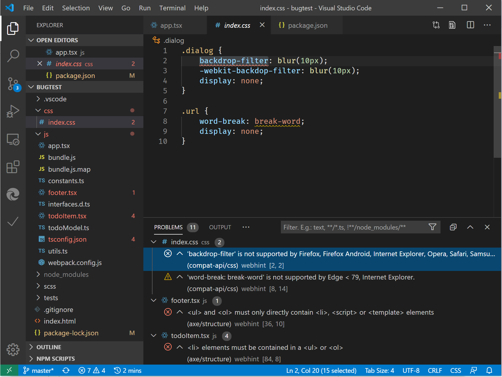

# Visual Studio Code

[Visual Studio Code](https://code.visualstudio.com/Docs) es un editor de código fuente ligero pero eficaz que se ejecuta en el escritorio y está disponible para Windows, MacOS y Linux. Viene con compatibilidad integrada para JavaScript, TypeScript y node. js, por lo que es una excelente herramienta para desarrolladores web listos para utilizar. Vaya a [esta página](https://code.visualstudio.com/) para descargar el código de Visual Studio si aún no lo está usando.

## Extensions

<!-- We want to put something like the tiles for extensions VS Code uses on this page https://code.visualstudio.com/Docs#top-extensions but I don't think this is a markdown page. I think it's a web page. I couldn't find anything in https://github.com/Microsoft/vscode-docs that looks like this page. In the meantime, here's what I've come up with: -->

Para adquirir cualquiera de las extensiones resaltadas a continuación, vaya a extensiones ( `Ctrl`  +  `Shift`  +  `X` en Windows o `Command`  +  `Shift`  +  `X` en Mac) en vs Code.

Busque la extensión específica en el Marketplace y seleccione **instalar**.

## Depurador para Microsoft Edge

Depura el código de JavaScript front-end línea por línea y muestra las `console.log()` instrucciones directamente en [Visual Studio Code](https://code.visualstudio.com/) usando la extensión [de código de depurador para Microsoft Edge](https://marketplace.visualstudio.com/items?itemName=msjsdiag.debugger-for-edge) vs.

Usa el [depurador para la extensión de código de Microsoft Edge](https://marketplace.visualstudio.com/items?itemName=msjsdiag.debugger-for-edge) vs para iniciar o adjuntar a Microsoft Edge (EdgeHTML) y Microsoft Edge (cromo). Consulte [esta página](./debugger-for-edge.md) para obtener un tutorial sobre la depuración de Microsoft Edge desde vs Code y la configuración de ejemplo de **lanzamiento. JSON** .

## Elementos de Microsoft Edge

Al agregar los [elementos de la extensión de código de Microsoft Edge](https://marketplace.visualstudio.com/items?itemName=ms-edgedevtools.vscode-edge-devtools) vs, puedes usar la herramienta elementos del explorador desde el código de Visual Studio. Al iniciar o adjuntar, la herramienta elementos se conectará a una instancia de Microsoft Edge, mostrará la estructura HTML en tiempo de ejecución y le permitirá modificar el diseño o corregir problemas de estilo.

Para obtener más información, consulta [esta página](./elements-for-edge.md).

## sugerencia

Use [webhint](https://webhint.io), una herramienta de desplegable personalizable, para mejorar la accesibilidad, el rendimiento, la compatibilidad entre exploradores, la compatibilidad de PWA y la seguridad de su sitio. Comprueba los procedimientos recomendados y los errores comunes de tu código. Este proyecto de código abierto, desarrollado inicialmente por el equipo de Microsoft Edge, ahora forma parte de la [OpenJS Foundation](https://openjsf.org/). El equipo de Microsoft Edge continúa contribuyendo a la webhint junto con los desarrolladores web de la comunidad.

Identifique y solucione problemas en HTML, CSS, JavaScript, TypeScript y más agregando la [extensión webhint para vs Code](https://marketplace.visualstudio.com/items?itemName=webhint.vscode-webhint). Las sugerencias aparecen como líneas de subrayado y se resumen en el panel problemas.

Para obtener más información, consulta [Cómo usar webhint en Visual Studio Code](./webhint.md).
