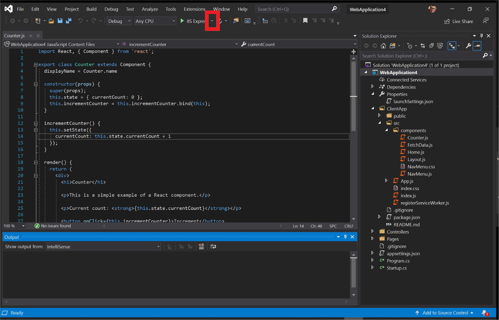
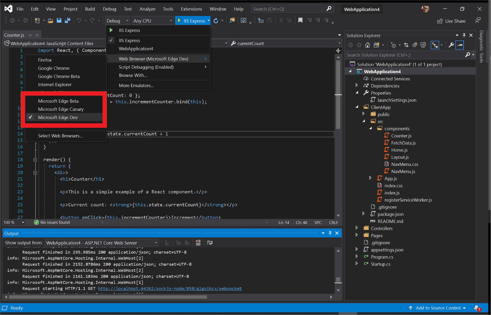
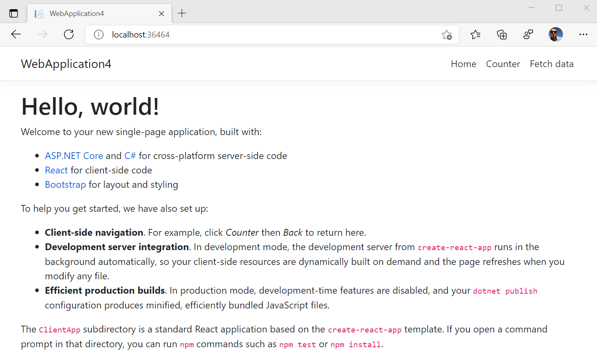
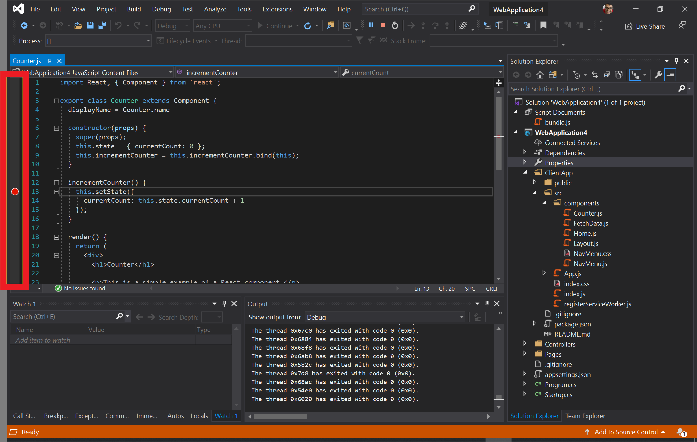
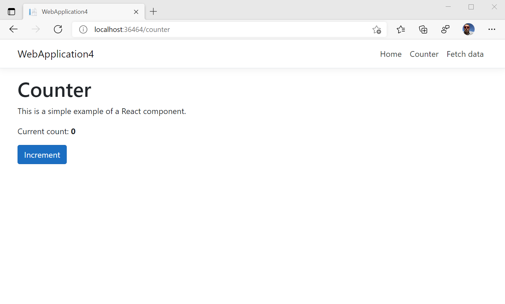

# <span data-ttu-id="a8c1a-104">Visual Studio</span><span class="sxs-lookup"><span data-stu-id="a8c1a-104">Visual Studio</span></span>

<span data-ttu-id="a8c1a-105">[Visual Studio](https://visualstudio.microsoft.com/vs/) es un entorno de desarrollo integrado (IDE) que puede usar para editar, depurar, generar y publicar aplicaciones Web.</span><span class="sxs-lookup"><span data-stu-id="a8c1a-105">[Visual Studio](https://visualstudio.microsoft.com/vs/) is an integrated development environment (IDE) that you can use to edit, debug, build, and publish your web applications.</span></span> <span data-ttu-id="a8c1a-106">Es un programa con multitud de características que puede usar para muchos aspectos de su desarrollo web.</span><span class="sxs-lookup"><span data-stu-id="a8c1a-106">It is a feature-rich program that can be used for many aspects of your web development.</span></span> <span data-ttu-id="a8c1a-107">Además del editor estándar y el depurador que proporcionan la mayoría de los IDE, Visual Studio incluye compiladores, herramientas de finalización de código, diseñadores gráficos y muchas otras características para facilitar el proceso de desarrollo.</span><span class="sxs-lookup"><span data-stu-id="a8c1a-107">Over and above the standard editor and debugger that most IDEs provide, Visual Studio includes compilers, code completion tools, graphical designers, and many more features to ease your development process.</span></span> <span data-ttu-id="a8c1a-108">Vaya a [esta página](https://visualstudio.microsoft.com/downloads/) para descargar Visual Studio si aún no lo está usando.</span><span class="sxs-lookup"><span data-stu-id="a8c1a-108">Head to [this page](https://visualstudio.microsoft.com/downloads/) to download Visual Studio if you aren't using it yet.</span></span>

<span data-ttu-id="a8c1a-109">Por el momento, Visual Studio 2019 admite la depuración de JavaScript en Microsoft Edge para tus aplicaciones básicas de ASP\.NET y ASP\.NET.</span><span class="sxs-lookup"><span data-stu-id="a8c1a-109">Currently, Visual Studio 2019 supports debugging JavaScript in Microsoft Edge for your ASP\.NET Framework and ASP\.NET Core applications.</span></span> <span data-ttu-id="a8c1a-110">Siga los pasos que se indican a continuación para depurar Microsoft Edge desde Visual Studio.</span><span class="sxs-lookup"><span data-stu-id="a8c1a-110">Follow the steps below to debug Microsoft Edge from Visual Studio.</span></span>

## <span data-ttu-id="a8c1a-111">Iniciar Microsoft Edge</span><span class="sxs-lookup"><span data-stu-id="a8c1a-111">Launch Microsoft Edge</span></span>
<span data-ttu-id="a8c1a-112">Visual Studio crea tu aplicación de núcleo de ASP\.NET y ASP\.NET, inicia el servidor Web, inicia Microsoft Edge y conecta el depurador de Visual Studio todo al hacer clic en un solo botón.</span><span class="sxs-lookup"><span data-stu-id="a8c1a-112">Visual Studio builds your ASP\.NET and ASP\.NET Core application, starts your web server, launches Microsoft Edge, and connects the Visual Studio debugger all at the click of a single button.</span></span> <span data-ttu-id="a8c1a-113">Esto te permite depurar JavaScript que se ejecuta en Microsoft Edge directamente desde tu IDE.</span><span class="sxs-lookup"><span data-stu-id="a8c1a-113">This enables you to debug JavaScript running in Microsoft Edge directly from your IDE!</span></span>

### <span data-ttu-id="a8c1a-114">Crear una nueva aplicación Web de ASP.NET Core</span><span class="sxs-lookup"><span data-stu-id="a8c1a-114">Create a new ASP.NET Core web application</span></span>

<span data-ttu-id="a8c1a-115">Abra Visual Studio 2019 y seleccione **crear un nuevo proyecto**.</span><span class="sxs-lookup"><span data-stu-id="a8c1a-115">Open Visual Studio 2019 and select **Create a new project**.</span></span> <span data-ttu-id="a8c1a-116">En la siguiente pantalla, seleccione **ASP\.net principal de la aplicación web** y haga clic en **siguiente**.</span><span class="sxs-lookup"><span data-stu-id="a8c1a-116">On the next screen, select **ASP\.NET Core Web Application** and click **Next**.</span></span>

> ##### <span data-ttu-id="a8c1a-117">Figura 1</span><span class="sxs-lookup"><span data-stu-id="a8c1a-117">Figure 1</span></span>  
> <span data-ttu-id="a8c1a-118">Crear una nueva aplicación Web de ASP.NET Core </span><span class="sxs-lookup"><span data-stu-id="a8c1a-118">Create a new ASP.NET Core Web Application </span></span>  

<span data-ttu-id="a8c1a-119">Proporcione un **nombre de proyecto** para el nuevo proyecto y haga clic en **crear**.</span><span class="sxs-lookup"><span data-stu-id="a8c1a-119">Provide a **Project name** for your new project and click **Create**.</span></span> <span data-ttu-id="a8c1a-120">Para los fines de este ejemplo, seleccione **reAct. js** como la plantilla que muestra cómo integrar reAct. js en una aplicación de núcleo de ASP.net y haga clic en **crear**.</span><span class="sxs-lookup"><span data-stu-id="a8c1a-120">For the purposes of this example, select **React.js** as the template which shows you how to integrate React.js with an ASP.NET Core application and click **Create**.</span></span>

### <span data-ttu-id="a8c1a-121">Iniciar Microsoft Edge desde Visual Studio</span><span class="sxs-lookup"><span data-stu-id="a8c1a-121">Launch Microsoft Edge from Visual Studio</span></span>

<span data-ttu-id="a8c1a-122">Una vez que se haya creado tu proyecto, abre **ClientApp/src/Components/Counter. js**.</span><span class="sxs-lookup"><span data-stu-id="a8c1a-122">Once your project has been created, open **ClientApp/src/components/Counter.js**.</span></span> <span data-ttu-id="a8c1a-123">Ahora, indica a Visual Studio que depure JavaScript seleccionando la lista desplegable junto al botón verde de **reproducción** y a **IIS Express**.</span><span class="sxs-lookup"><span data-stu-id="a8c1a-123">Now, tell Visual Studio to debug JavaScript by selecting the dropdown next to the green **Play** button and **IIS Express**.</span></span> 

> ##### <span data-ttu-id="a8c1a-124">Figura 2</span><span class="sxs-lookup"><span data-stu-id="a8c1a-124">Figure 2</span></span>  
> <span data-ttu-id="a8c1a-125">La lista desplegable junto al botón verde de **reproducción** e **IIS Express**, 
> </span><span class="sxs-lookup"><span data-stu-id="a8c1a-125">The dropdown next to the green **Play** button and **IIS Express**
</span></span>  

<span data-ttu-id="a8c1a-126">Seleccione **depuración de scripts** y haga clic en **Habilitar**.</span><span class="sxs-lookup"><span data-stu-id="a8c1a-126">Select **Script Debugging** and click **Enabled**.</span></span>

> ##### <span data-ttu-id="a8c1a-127">Imagen 3</span><span class="sxs-lookup"><span data-stu-id="a8c1a-127">Figure 3</span></span>  
> <span data-ttu-id="a8c1a-128">Habilitar la depuración de scripts en Visual Studio </span><span class="sxs-lookup"><span data-stu-id="a8c1a-128">Enable script debugging in Visual Studio </span></span>  

<span data-ttu-id="a8c1a-129">En la misma lista desplegable, seleccione **explorador Web** y haga clic en el canal de vista previa de Microsoft Edge que desea que Visual Studio inicie: Microsoft Edge Canarias, dev o beta.</span><span class="sxs-lookup"><span data-stu-id="a8c1a-129">In the same dropdown, select **Web Browser** and click the preview channel of Microsoft Edge that you want Visual Studio to launch: Microsoft Edge Canary, Dev, or Beta.</span></span> <span data-ttu-id="a8c1a-130">Si todavía no lo ha hecho, vaya a [esta página](https://www.microsoftedgeinsider.com/download) para instalar los canales de Microsoft Edge Preview.</span><span class="sxs-lookup"><span data-stu-id="a8c1a-130">If you haven't already, head to [this page](https://www.microsoftedgeinsider.com/download) to install the Microsoft Edge preview channels.</span></span>

> ##### <span data-ttu-id="a8c1a-131">Imagen 4</span><span class="sxs-lookup"><span data-stu-id="a8c1a-131">Figure 4</span></span>  
> <span data-ttu-id="a8c1a-132">Selecciona el canal de vista previa de Microsoft Edge que deseas que Visual Studio inicie </span><span class="sxs-lookup"><span data-stu-id="a8c1a-132">Select the preview channel of Microsoft Edge that you want Visual Studio to launch </span></span>  

> [!NOTE]
> <span data-ttu-id="a8c1a-133">Si selecciona Microsoft Edge (EdgeHTML), Visual Studio lo iniciará en lugar de Microsoft Edge (cromo).</span><span class="sxs-lookup"><span data-stu-id="a8c1a-133">If you select Microsoft Edge (EdgeHTML), Visual Studio will launch that instead of Microsoft Edge (Chromium).</span></span> <span data-ttu-id="a8c1a-134">[Instale los canales de vista previa de Microsoft Edge](https://www.microsoftedgeinsider.com/download) y selecciónelos o asegúrese de que la versión de Microsoft Edge instalada en su equipo sea Microsoft Edge (cromo) y no Microsoft Edge (EdgeHTML).</span><span class="sxs-lookup"><span data-stu-id="a8c1a-134">[Install the preview channels of Microsoft Edge](https://www.microsoftedgeinsider.com/download) and select them or ensure that the version of Microsoft Edge installed on your machine is Microsoft Edge (Chromium) and not Microsoft Edge (EdgeHTML).</span></span>

<span data-ttu-id="a8c1a-135">Ahora que Visual Studio está configurado correctamente, haga clic en el botón verde de **reproducción** .</span><span class="sxs-lookup"><span data-stu-id="a8c1a-135">Now that Visual Studio is correctly configured, click the green **Play** button.</span></span> <span data-ttu-id="a8c1a-136">Visual Studio compilará la aplicación, iniciará el servidor Web, iniciará Microsoft Edge y se desplazará a `https://localhost:44362/` o cualquier puerto que se especifique en **launchSettings. JSON**.</span><span class="sxs-lookup"><span data-stu-id="a8c1a-136">Visual Studio will build your application, start the web server, launch Microsoft Edge, and navigate to `https://localhost:44362/` or whatever port is specified in **launchSettings.json**.</span></span>

> ##### <span data-ttu-id="a8c1a-137">Imagen 5</span><span class="sxs-lookup"><span data-stu-id="a8c1a-137">Figure 5</span></span>  
> <span data-ttu-id="a8c1a-138">Microsoft Edge se ha iniciado desde Visual Studio </span><span class="sxs-lookup"><span data-stu-id="a8c1a-138">Microsoft Edge launched from Visual Studio </span></span>  

### <span data-ttu-id="a8c1a-139">Depurar JavaScript ejecutándose en Microsoft Edge</span><span class="sxs-lookup"><span data-stu-id="a8c1a-139">Debug JavaScript running in Microsoft Edge</span></span>

<span data-ttu-id="a8c1a-140">Vuelva a Visual Studio.</span><span class="sxs-lookup"><span data-stu-id="a8c1a-140">Switch back to Visual Studio.</span></span> <span data-ttu-id="a8c1a-141">En **Counter. js**, establezca un punto de interrupción en la línea 13 haciendo clic en el medianil situado junto a la línea.</span><span class="sxs-lookup"><span data-stu-id="a8c1a-141">In **Counter.js**, set a breakpoint on Line 13 by clicking in the gutter next to that line.</span></span>

> ##### <span data-ttu-id="a8c1a-142">Imagen 6</span><span class="sxs-lookup"><span data-stu-id="a8c1a-142">Figure 6</span></span>
> <span data-ttu-id="a8c1a-143">Para establecer un punto de interrupción en Visual Studio, haga clic en el medianil que se encuentra junto a la línea 13 en **Counter. js** 
> </span><span class="sxs-lookup"><span data-stu-id="a8c1a-143">Setting a breakpoint in Visual Studio by clicking on the gutter next to Line 13 in **Counter.js**
</span></span>  

<span data-ttu-id="a8c1a-144">Ahora, vuelve a la instancia de Microsoft Edge que iniciaste Visual Studio.</span><span class="sxs-lookup"><span data-stu-id="a8c1a-144">Now switch back to the instance of Microsoft Edge that Visual Studio launched.</span></span> <span data-ttu-id="a8c1a-145">Haga clic en el **contador** en el NavMenu a la izquierda de la página.</span><span class="sxs-lookup"><span data-stu-id="a8c1a-145">Click on **Counter** in the NavMenu on the left of the page.</span></span> <span data-ttu-id="a8c1a-146">Ahora, haga clic en **incremento**.</span><span class="sxs-lookup"><span data-stu-id="a8c1a-146">Now click **Increment**.</span></span>

> ##### <span data-ttu-id="a8c1a-147">Imagen 7</span><span class="sxs-lookup"><span data-stu-id="a8c1a-147">Figure 7</span></span>
> <span data-ttu-id="a8c1a-148">La página de contador de nuestra aplicación Web de ASP.NET Core </span><span class="sxs-lookup"><span data-stu-id="a8c1a-148">The Counter page in our ASP.NET Core web application </span></span>  

<span data-ttu-id="a8c1a-149">El depurador de JavaScript en Visual Studio va a hacer clic en el punto de interrupción que establecemos en **Counter. js**.</span><span class="sxs-lookup"><span data-stu-id="a8c1a-149">The JavaScript debugger in Visual Studio is going to hit the breakpoint we set in **Counter.js**.</span></span> <span data-ttu-id="a8c1a-150">Visual Studio ya ha pausado la ejecución de JavaScript en Microsoft Edge y puedes recorrer la secuencia línea a línea.</span><span class="sxs-lookup"><span data-stu-id="a8c1a-150">Visual Studio has now paused execution of the JavaScript running in Microsoft Edge and you can step through the script line-by-line.</span></span>

> ##### <span data-ttu-id="a8c1a-151">Imagen 8</span><span class="sxs-lookup"><span data-stu-id="a8c1a-151">Figure 8</span></span>
> <span data-ttu-id="a8c1a-152">Una pausa en Visual Studio en la ejecución de JavaScript en Microsoft Edge </span><span class="sxs-lookup"><span data-stu-id="a8c1a-152">Visual Studio pausing JavaScript running in Microsoft Edge </span></span>  

<span data-ttu-id="a8c1a-153">Este ejemplo era una pequeña demostración de la funcionalidad disponible en Visual Studio.</span><span class="sxs-lookup"><span data-stu-id="a8c1a-153">This example was just a minor demonstration of the functionality available in Visual Studio.</span></span> <span data-ttu-id="a8c1a-154">Para obtener más información sobre todo lo que puede hacer en Visual Studio 2019, lea [su documentación](https://docs.microsoft.com/visualstudio/windows/?view=vs-2019).</span><span class="sxs-lookup"><span data-stu-id="a8c1a-154">Learn more about all the things you can do in Visual Studio 2019 by reading [their documentation](https://docs.microsoft.com/visualstudio/windows/?view=vs-2019).</span></span>

## <span data-ttu-id="a8c1a-155">Adjuntar a Microsoft Edge</span><span class="sxs-lookup"><span data-stu-id="a8c1a-155">Attach to Microsoft Edge</span></span>
<span data-ttu-id="a8c1a-156">En el flujo de trabajo anterior, Visual Studio inicia Microsoft Edge.</span><span class="sxs-lookup"><span data-stu-id="a8c1a-156">In the previous workflow, Visual Studio launches Microsoft Edge.</span></span> <span data-ttu-id="a8c1a-157">Con este flujo de trabajo, podrás adjuntar el depurador de Visual Studio a una instancia ya en ejecución de Microsoft Edge.</span><span class="sxs-lookup"><span data-stu-id="a8c1a-157">With this workflow, you will be able to attach the Visual Studio debugger to an already running instance of Microsoft Edge.</span></span> 

<span data-ttu-id="a8c1a-158">En primer lugar, asegúrate de que no haya instancias en ejecución de Microsoft Edge.</span><span class="sxs-lookup"><span data-stu-id="a8c1a-158">First, ensure that there are no running instances of Microsoft Edge.</span></span> <span data-ttu-id="a8c1a-159">Ahora, desde el terminal, ejecute el siguiente comando:</span><span class="sxs-lookup"><span data-stu-id="a8c1a-159">Now, from your terminal, run the following command:</span></span>

```console
start msedge –remote-debugging-port=9222
```

<span data-ttu-id="a8c1a-160">En Visual Studio, abra el menú **depurar** y seleccione **asociar al proceso** o presionar `Ctrl`  +  `Alt`  +  `P` .</span><span class="sxs-lookup"><span data-stu-id="a8c1a-160">From Visual Studio, open the **Debug** menu and select **Attach to Process** or press `Ctrl` + `Alt` + `P`.</span></span>

> ##### <span data-ttu-id="a8c1a-161">Imagen 9</span><span class="sxs-lookup"><span data-stu-id="a8c1a-161">Figure 9</span></span>
> <span data-ttu-id="a8c1a-162">Seleccionar **adjuntar al proceso** en Visual Studio </span><span class="sxs-lookup"><span data-stu-id="a8c1a-162">Selecting **Attach to Process** in Visual Studio </span></span>  

<span data-ttu-id="a8c1a-163">En el cuadro de diálogo **asociar al proceso** , establezca **tipo de conexión** en **cromo DevTools Protocol WebSocket (sin autenticación)**.</span><span class="sxs-lookup"><span data-stu-id="a8c1a-163">From the **Attach to Process** dialog, set **Connection type** to **Chrome devtools protocol websocket (no authentication)**.</span></span> <span data-ttu-id="a8c1a-164">En el cuadro de texto **conexión de destino** , escriba `http://localhost:9222/` y presione `Enter` .</span><span class="sxs-lookup"><span data-stu-id="a8c1a-164">In the **Connecting target** textbox, type in `http://localhost:9222/` and press `Enter`.</span></span> <span data-ttu-id="a8c1a-165">Debería ver la lista de las pestañas abiertas que tiene en Microsoft Edge indicadas en el cuadro de diálogo **asociar al proceso** .</span><span class="sxs-lookup"><span data-stu-id="a8c1a-165">You should see the list of open tabs you have in Microsoft Edge listed out in the **Attach to Process** dialog.</span></span>

> ##### <span data-ttu-id="a8c1a-166">Imagen 10</span><span class="sxs-lookup"><span data-stu-id="a8c1a-166">Figure 10</span></span>
> <span data-ttu-id="a8c1a-167">Configuración del cuadro de diálogo asociar **al proceso** en Visual Studio </span><span class="sxs-lookup"><span data-stu-id="a8c1a-167">Configuring the **Attach to Process** dialog in Visual Studio </span></span>  

<span data-ttu-id="a8c1a-168">Haga clic en **seleccionar...**</span><span class="sxs-lookup"><span data-stu-id="a8c1a-168">Click **Select…**</span></span> <span data-ttu-id="a8c1a-169">y verifica **JavaScript (Microsoft Edge: cromo)**.</span><span class="sxs-lookup"><span data-stu-id="a8c1a-169">and check **JavaScript (Microsoft Edge – Chromium)**.</span></span> <span data-ttu-id="a8c1a-170">Puede Agregar pestañas, ir a nuevas pestañas y cerrar pestañas y ver los cambios reflejados en el cuadro de diálogo **asociar al proceso** haciendo clic en el botón **Actualizar** .</span><span class="sxs-lookup"><span data-stu-id="a8c1a-170">You can add tabs, navigate to new tabs, and close tabs and see those changes reflected in the **Attach to Process** dialog by clicking the **Refresh** button.</span></span> <span data-ttu-id="a8c1a-171">Seleccione la pestaña que quiera depurar y haga clic en **adjuntar**.</span><span class="sxs-lookup"><span data-stu-id="a8c1a-171">Select the tab you want to debug and click **Attach**.</span></span>

<span data-ttu-id="a8c1a-172">El depurador de Visual Studio se ha adjuntado a Microsoft Edge.</span><span class="sxs-lookup"><span data-stu-id="a8c1a-172">The Visual Studio debugger is now attached to Microsoft Edge!</span></span> <span data-ttu-id="a8c1a-173">Puede pausar JavaScript, establecer puntos de interrupción y ver `console.log()` las instrucciones directamente en la ventana de salida de depuración en Visual Studio.</span><span class="sxs-lookup"><span data-stu-id="a8c1a-173">You can pause execution of JavaScript, set breakpoints, and see `console.log()` statements directly in the Debug Output window in Visual Studio.</span></span>

## <span data-ttu-id="a8c1a-174">Comentarios</span><span class="sxs-lookup"><span data-stu-id="a8c1a-174">Feedback</span></span>
<span data-ttu-id="a8c1a-175">Estamos ansiosos por obtener más información sobre cómo trabajar con JavaScript en Visual Studio.</span><span class="sxs-lookup"><span data-stu-id="a8c1a-175">We're eager to learn more about how you work with JavaScript in Visual Studio!</span></span> <span data-ttu-id="a8c1a-176">Para enviarnos tus comentarios, haz clic en el icono de **comentarios** en Visual Studio o en tweets [@VisualStudio y @EdgeDevTools](https://twitter.com/intent/tweet?text=@VisualStudio+@EdgeDevTools).</span><span class="sxs-lookup"><span data-stu-id="a8c1a-176">Please send us feedback by clicking the **Feedback** icon in Visual Studio or by tweeting [@VisualStudio and @EdgeDevTools](https://twitter.com/intent/tweet?text=@VisualStudio+@EdgeDevTools).</span></span>

> ##### <span data-ttu-id="a8c1a-177">Imagen 11</span><span class="sxs-lookup"><span data-stu-id="a8c1a-177">Figure 11</span></span>
> <span data-ttu-id="a8c1a-178">El icono de **comentarios** en Visual Studio </span><span class="sxs-lookup"><span data-stu-id="a8c1a-178">The **Feedback** icon in Visual Studio </span></span>  
