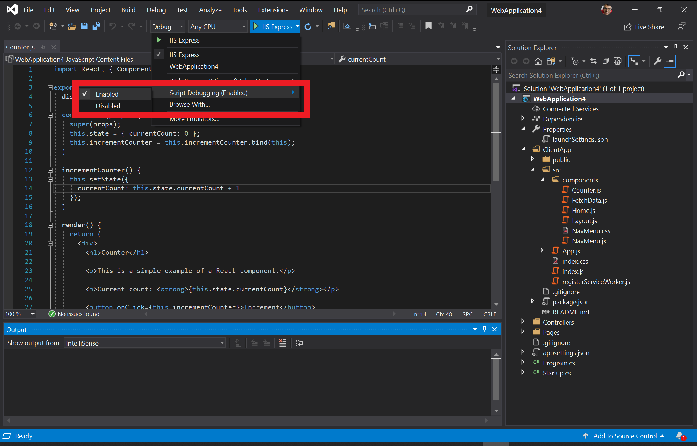

# Visual Studio

[Visual Studio](https://visualstudio.microsoft.com/vs/) es un entorno de desarrollo integrado (IDE) que puede usar para editar, depurar, generar y publicar aplicaciones Web. Es un programa con multitud de características que puede usar para muchos aspectos de su desarrollo web. Además del editor estándar y el depurador que proporcionan la mayoría de los IDE, Visual Studio incluye compiladores, herramientas de finalización de código, diseñadores gráficos y muchas otras características para facilitar el proceso de desarrollo. Vaya a [esta página](https://visualstudio.microsoft.com/downloads/) para descargar Visual Studio si aún no lo está usando.

Por el momento, Visual Studio 2019 admite la depuración de JavaScript en Microsoft Edge para tus aplicaciones básicas de ASP\.NET y ASP\.NET. Siga los pasos que se indican a continuación para depurar Microsoft Edge desde Visual Studio.

## Iniciar Microsoft Edge
Visual Studio crea tu aplicación de núcleo de ASP\.NET y ASP\.NET, inicia el servidor Web, inicia Microsoft Edge y conecta el depurador de Visual Studio todo al hacer clic en un solo botón. Esto te permite depurar JavaScript que se ejecuta en Microsoft Edge directamente desde tu IDE.

### Crear una nueva aplicación Web de ASP.NET Core

Abra Visual Studio 2019 y seleccione **crear un nuevo proyecto**. En la siguiente pantalla, seleccione **ASP\.net principal de la aplicación web** y haga clic en **siguiente**.

> ##### Figura 1  
> Crear una nueva aplicación Web de ASP.NET Core   

Proporcione un **nombre de proyecto** para el nuevo proyecto y haga clic en **crear**. Para los fines de este ejemplo, seleccione **reAct. js** como la plantilla que muestra cómo integrar reAct. js en una aplicación de núcleo de ASP.net y haga clic en **crear**.

### Iniciar Microsoft Edge desde Visual Studio

Una vez que se haya creado tu proyecto, abre **ClientApp/src/Components/Counter. js**. Ahora, indica a Visual Studio que depure JavaScript seleccionando la lista desplegable junto al botón verde de **reproducción** y a **IIS Express**. 

> ##### Figura 2  
> La lista desplegable junto al botón verde de **reproducción** e **IIS Express**, 
>   

Seleccione **depuración de scripts** y haga clic en **Habilitar**.

> ##### Imagen 3  
> Habilitar la depuración de scripts en Visual Studio   

En la misma lista desplegable, seleccione **explorador Web** y haga clic en el canal de vista previa de Microsoft Edge que desea que Visual Studio inicie: Microsoft Edge Canarias, dev o beta. Si todavía no lo ha hecho, vaya a [esta página](https://www.microsoftedgeinsider.com/download) para instalar los canales de Microsoft Edge Preview.

> ##### Imagen 4  
> Selecciona el canal de vista previa de Microsoft Edge que deseas que Visual Studio inicie   

> [!NOTE]
> Si selecciona Microsoft Edge (EdgeHTML), Visual Studio lo iniciará en lugar de Microsoft Edge (cromo). [Instale los canales de vista previa de Microsoft Edge](https://www.microsoftedgeinsider.com/download) y selecciónelos o asegúrese de que la versión de Microsoft Edge instalada en su equipo sea Microsoft Edge (cromo) y no Microsoft Edge (EdgeHTML).

Ahora que Visual Studio está configurado correctamente, haga clic en el botón verde de **reproducción** . Visual Studio compilará la aplicación, iniciará el servidor Web, iniciará Microsoft Edge y se desplazará a `https://localhost:44362/` o cualquier puerto que se especifique en **launchSettings. JSON**.

> ##### Imagen 5  
> Microsoft Edge se ha iniciado desde Visual Studio   

### Depurar JavaScript ejecutándose en Microsoft Edge

Vuelva a Visual Studio. En **Counter. js**, establezca un punto de interrupción en la línea 13 haciendo clic en el medianil situado junto a la línea.

> ##### Imagen 6
> Para establecer un punto de interrupción en Visual Studio, haga clic en el medianil que se encuentra junto a la línea 13 en **Counter. js** 
>   

Ahora, vuelve a la instancia de Microsoft Edge que iniciaste Visual Studio. Haga clic en el **contador** en el NavMenu a la izquierda de la página. Ahora, haga clic en **incremento**.

> ##### Imagen 7
> La página de contador de nuestra aplicación Web de ASP.NET Core   

El depurador de JavaScript en Visual Studio va a hacer clic en el punto de interrupción que establecemos en **Counter. js**. Visual Studio ya ha pausado la ejecución de JavaScript en Microsoft Edge y puedes recorrer la secuencia línea a línea.

> ##### Imagen 8
> Una pausa en Visual Studio en la ejecución de JavaScript en Microsoft Edge   

Este ejemplo era una pequeña demostración de la funcionalidad disponible en Visual Studio. Para obtener más información sobre todo lo que puede hacer en Visual Studio 2019, lea [su documentación](https://docs.microsoft.com/visualstudio/windows/?view=vs-2019).

## Adjuntar a Microsoft Edge
En el flujo de trabajo anterior, Visual Studio inicia Microsoft Edge. Con este flujo de trabajo, podrás adjuntar el depurador de Visual Studio a una instancia ya en ejecución de Microsoft Edge. 

En primer lugar, asegúrate de que no haya instancias en ejecución de Microsoft Edge. Ahora, desde el terminal, ejecute el siguiente comando:

```console
start msedge –remote-debugging-port=9222
```

En Visual Studio, abra el menú **depurar** y seleccione **asociar al proceso** o presionar `Ctrl`  +  `Alt`  +  `P` .

> ##### Imagen 9
> Seleccionar **adjuntar al proceso** en Visual Studio   

En el cuadro de diálogo **asociar al proceso** , establezca **tipo de conexión** en **cromo DevTools Protocol WebSocket (sin autenticación)**. En el cuadro de texto **conexión de destino** , escriba `http://localhost:9222/` y presione `Enter` . Debería ver la lista de las pestañas abiertas que tiene en Microsoft Edge indicadas en el cuadro de diálogo **asociar al proceso** .

> ##### Imagen 10
> Configuración del cuadro de diálogo asociar **al proceso** en Visual Studio   

Haga clic en **seleccionar...** y verifica **JavaScript (Microsoft Edge: cromo)**. Puede Agregar pestañas, ir a nuevas pestañas y cerrar pestañas y ver los cambios reflejados en el cuadro de diálogo **asociar al proceso** haciendo clic en el botón **Actualizar** . Seleccione la pestaña que quiera depurar y haga clic en **adjuntar**.

El depurador de Visual Studio se ha adjuntado a Microsoft Edge. Puede pausar JavaScript, establecer puntos de interrupción y ver `console.log()` las instrucciones directamente en la ventana de salida de depuración en Visual Studio.

## Comentarios
Estamos ansiosos por obtener más información sobre cómo trabajar con JavaScript en Visual Studio. Para enviarnos tus comentarios, haz clic en el icono de **comentarios** en Visual Studio o en tweets [@VisualStudio y @EdgeDevTools](https://twitter.com/intent/tweet?text=@VisualStudio+@EdgeDevTools).

> ##### Imagen 11
> El icono de **comentarios** en Visual Studio   
