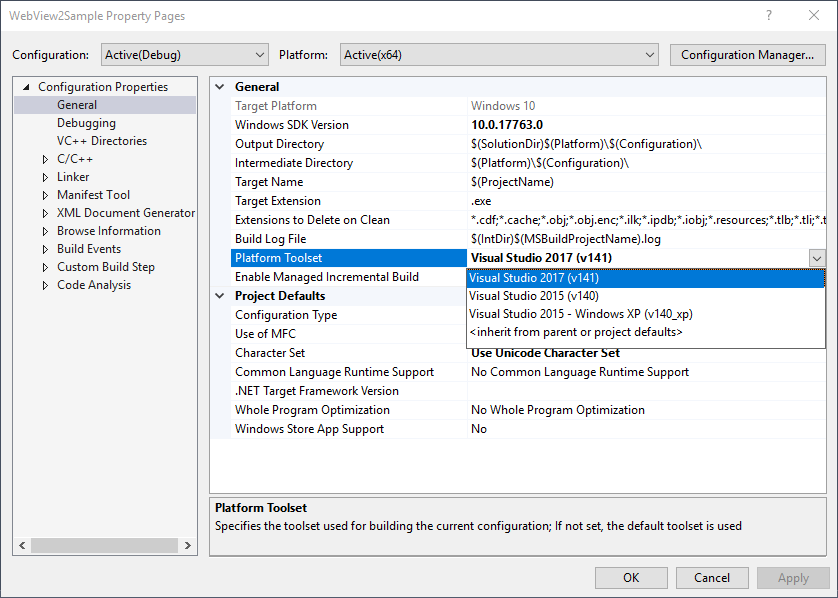
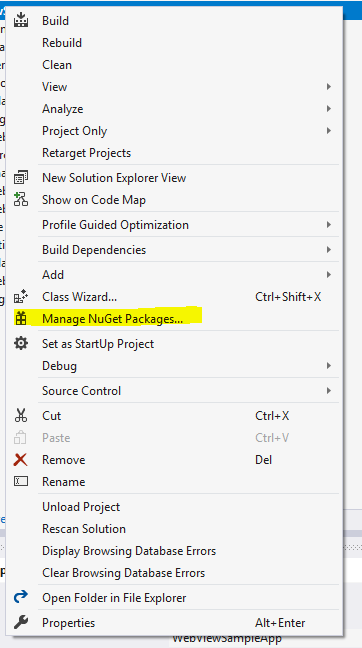
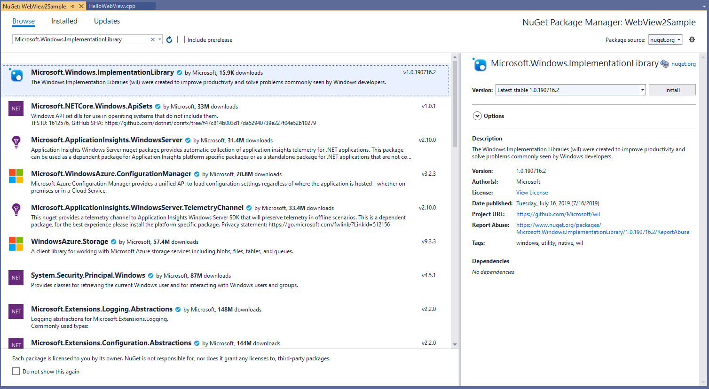
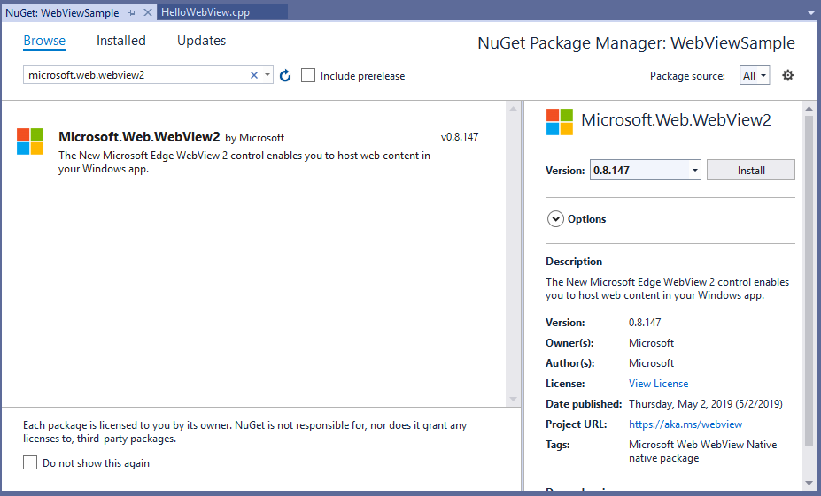
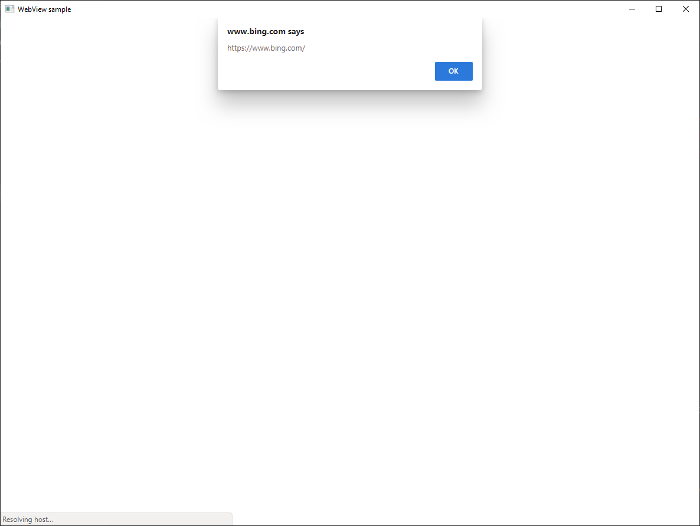

# <span data-ttu-id="b4c30-104">Introducción a WebView2 (vista previa para desarrolladores)</span><span class="sxs-lookup"><span data-stu-id="b4c30-104">Getting Started with WebView2 (developer preview)</span></span>

<span data-ttu-id="b4c30-105">Este tutorial pasa por las funcionalidades más usadas de [WebView2 (Developer Preview)](https://aka.ms/webview) y comienza a crear tu primera aplicación de WebView2.</span><span class="sxs-lookup"><span data-stu-id="b4c30-105">This walkthrough goes over the commonly used functionalities of [WebView2 (developer preview)](https://aka.ms/webview) and gets you started on creating your first WebView2 app.</span></span> <span data-ttu-id="b4c30-106">Visita la referencia de la [API](../reference/win32/0-9-488-reference-webview2.md) para obtener más información sobre las API individuales.</span><span class="sxs-lookup"><span data-stu-id="b4c30-106">Visit [API reference](../reference/win32/0-9-488-reference-webview2.md) to learn more about individual APIs.</span></span>  

## <span data-ttu-id="b4c30-107">Requisitos previos</span><span class="sxs-lookup"><span data-stu-id="b4c30-107">Prerequisites</span></span>

* <span data-ttu-id="b4c30-108">[Microsoft Edge (cromo)](https://www.microsoftedgeinsider.com/download/) instalado en el sistema operativo compatible (actualmente Windows 10, Windows 8,1 y Windows 7).</span><span class="sxs-lookup"><span data-stu-id="b4c30-108">[Microsoft Edge (Chromium)](https://www.microsoftedgeinsider.com/download/) installed on supported OS (currently Windows 10, Windows 8.1, and Windows 7).</span></span> <span data-ttu-id="b4c30-109">**Se recomienda usar el canal Canarias y la versión mínima requerida es 82.0.488.0**.</span><span class="sxs-lookup"><span data-stu-id="b4c30-109">**We recommend using the Canary channel and the minimum required version is 82.0.488.0**.</span></span>
* <span data-ttu-id="b4c30-110">[Visual Studio](https://visualstudio.microsoft.com/) 2015 o posterior con compatibilidad con C++ instalado.</span><span class="sxs-lookup"><span data-stu-id="b4c30-110">[Visual Studio](https://visualstudio.microsoft.com/) 2015 or later with C++ support installed.</span></span>

## <span data-ttu-id="b4c30-111">Paso 1: crear una sola aplicación Win32 de ventana</span><span class="sxs-lookup"><span data-stu-id="b4c30-111">Step 1 - Create a single window win32 app</span></span>

<span data-ttu-id="b4c30-112">Comenzaremos con un proyecto de escritorio básico que contenga una sola ventana principal.</span><span class="sxs-lookup"><span data-stu-id="b4c30-112">We will start with a basic desktop project containing a single main window.</span></span> <span data-ttu-id="b4c30-113">Como este no es el principal enfoque de este tutorial, simplemente usaremos código de ejemplo modificado de [Tutorial: crear una aplicación de escritorio de Windows tradicional (C++)](/cpp/windows/walkthrough-creating-windows-desktop-applications-cpp?view=vs-2019).</span><span class="sxs-lookup"><span data-stu-id="b4c30-113">As this is not the main focus of this walkthrough, we will simply use modified sample code from [Walkthrough: Create a traditional Windows Desktop application (C++)](/cpp/windows/walkthrough-creating-windows-desktop-applications-cpp?view=vs-2019).</span></span> <span data-ttu-id="b4c30-114">[Descarga](https://aka.ms/HelloWebView) la muestra modificada para comenzar.</span><span class="sxs-lookup"><span data-stu-id="b4c30-114">[Download](https://aka.ms/HelloWebView) the modified sample to get started.</span></span>

<span data-ttu-id="b4c30-115">Abra **WebView2GettingStarted. sln** en Visual Studio.</span><span class="sxs-lookup"><span data-stu-id="b4c30-115">Open **WebView2GettingStarted.sln** in Visual Studio.</span></span> <span data-ttu-id="b4c30-116">Si está usando una versión anterior de Visual Studio, haga clic con el botón secundario del mouse en el proyecto **WebView2GettingStarted** y haga clic en **propiedades**.</span><span class="sxs-lookup"><span data-stu-id="b4c30-116">If you are using an older version of Visual Studio, right click on the **WebView2GettingStarted** project and click **Properties**.</span></span> <span data-ttu-id="b4c30-117">En **propiedades de configuración**  >  **General**, modifique la **versión del SDK de Windows** y el conjunto de herramientas de **plataforma** para usar el SDK de Win10 y el conjunto de herramientas de vs disponibles.</span><span class="sxs-lookup"><span data-stu-id="b4c30-117">Under **Configuration Properties** > **General**, modify **Windows SDK Version** and **Platform Toolset** to use the Win10 SDK and VS toolset available to you.</span></span>



<span data-ttu-id="b4c30-119">Visual Studio puede mostrar algunos errores porque falta el archivo de encabezado WebView2, que debería desaparecer una vez completado el paso 2.</span><span class="sxs-lookup"><span data-stu-id="b4c30-119">Visual Studio may show some errors due to missing WebView2 header file, which should go away once Step 2 is completed.</span></span>

## <span data-ttu-id="b4c30-120">Paso 2: instalar el SDK de WebView2</span><span class="sxs-lookup"><span data-stu-id="b4c30-120">Step 2 - Install WebView2 SDK</span></span>

<span data-ttu-id="b4c30-121">Ahora vamos a agregar el SDK de WebView2 al proyecto.</span><span class="sxs-lookup"><span data-stu-id="b4c30-121">Now let's add the WebView2 SDK into the project.</span></span> <span data-ttu-id="b4c30-122">Para la versión preliminar de desarrollador, puedes instalar el SDK de Win32 a través de Nuget.</span><span class="sxs-lookup"><span data-stu-id="b4c30-122">For the developer preview, you can install the Win32 SDK via Nuget.</span></span>

1. <span data-ttu-id="b4c30-123">Haga clic con el botón derecho en el proyecto y haga clic en **administrar paquetes Nuget**.</span><span class="sxs-lookup"><span data-stu-id="b4c30-123">Right click the project and click **Manage Nuget Packages**.</span></span>

    

2. <span data-ttu-id="b4c30-125">Escriba **Microsoft. Windows. ImplementationLibrary** en la barra de búsqueda, haga clic en **Microsoft. Windows. ImplementationLibrary** de los resultados y haga clic en **instalar** en la ventana del lado derecho e instale el SDK más reciente.</span><span class="sxs-lookup"><span data-stu-id="b4c30-125">Enter **Microsoft.Windows.ImplementationLibrary** in the search bar, click **Microsoft.Windows.ImplementationLibrary** from the results, and click **Install** inthe right hand side window and install the latest SDK.</span></span> <span data-ttu-id="b4c30-126">Nuget descargará el SDK en su equipo.</span><span class="sxs-lookup"><span data-stu-id="b4c30-126">Nuget will download the SDK to your machine.</span></span> <span data-ttu-id="b4c30-127">Aunque usamos la [biblioteca de implementación de Windows](https://github.com/Microsoft/wil) y la [biblioteca de plantillas de C++ de Windows Runtime](/cpp/cppcx/wrl/windows-runtime-cpp-template-library-wrl?view=vs-2019) para facilitar el trabajo con com en este tutorial, son totalmente opcionales.</span><span class="sxs-lookup"><span data-stu-id="b4c30-127">While we use [Windows Implementation Library](https://github.com/Microsoft/wil) and [Windows Runtime C++ Template Library](/cpp/cppcx/wrl/windows-runtime-cpp-template-library-wrl?view=vs-2019) to make working with COM easier in this walkthrough, they are completely optional.</span></span>

    

3. <span data-ttu-id="b4c30-129">Escriba **Microsoft. Web. WebView2** en la barra de búsqueda, haga clic en **Microsoft. Web. WebView2** de los resultados y haga clic en **instalar** en la ventana del lado derecho e instale el SDK más reciente.</span><span class="sxs-lookup"><span data-stu-id="b4c30-129">Enter **Microsoft.Web.WebView2** in the search bar, click **Microsoft.Web.WebView2** from the results, and click **Install** in the right hand side window and install the latest SDK.</span></span> <span data-ttu-id="b4c30-130">Nuget descargará el SDK en su equipo.</span><span class="sxs-lookup"><span data-stu-id="b4c30-130">Nuget will download the SDK to your machine.</span></span>

    

4. <span data-ttu-id="b4c30-132">Incluya el encabezado WebView2.</span><span class="sxs-lookup"><span data-stu-id="b4c30-132">Include the WebView2 header.</span></span> <span data-ttu-id="b4c30-133">En **HelloWebView. cpp**, agregue `#include "WebView2.h"` debajo de las líneas de `#include` s.</span><span class="sxs-lookup"><span data-stu-id="b4c30-133">In **HelloWebView.cpp**, add `#include "WebView2.h"` below the lines of `#include`s.</span></span>

    ```cpp
    ...
    #include <wrl.h>
    #include <wil/com.h>
    // include WebView2 header
    #include "WebView2.h"
    ```

<span data-ttu-id="b4c30-134">Estás listo para usar y compilar en la API de WebView2.</span><span class="sxs-lookup"><span data-stu-id="b4c30-134">You are all set to use and build against the WebView2 API.</span></span> <span data-ttu-id="b4c30-135">Presione F5 para compilar y ejecutar la aplicación de ejemplo.</span><span class="sxs-lookup"><span data-stu-id="b4c30-135">Press F5 to build and run the sample app.</span></span> <span data-ttu-id="b4c30-136">Debería ver una aplicación que muestra una ventana vacía.</span><span class="sxs-lookup"><span data-stu-id="b4c30-136">You should see an app displaying an empty window.</span></span>


## <span data-ttu-id="b4c30-138">Paso 3: crear un único WebView en la ventana principal</span><span class="sxs-lookup"><span data-stu-id="b4c30-138">Step 3 - Create a single WebView within the parent window</span></span>

<span data-ttu-id="b4c30-139">Ahora vamos a agregar una vista previa a la ventana principal.</span><span class="sxs-lookup"><span data-stu-id="b4c30-139">Now let's add a WebView to the main window.</span></span> <span data-ttu-id="b4c30-140">Usaremos `CreateCoreWebView2Environment` para configurar el entorno y encontrar el explorador Microsoft Edge (cromo) que encienden el control.</span><span class="sxs-lookup"><span data-stu-id="b4c30-140">We'll use `CreateCoreWebView2Environment` to set up the environment and locate the Microsoft Edge (Chromium) browser powering the control.</span></span> <span data-ttu-id="b4c30-141">También puede usar `CreateCoreWebView2EnvironmentWithOptions` si desea especificar la ubicación del explorador, la carpeta de usuario, las marcas del explorador, etc., en lugar de usar la configuración predeterminada.</span><span class="sxs-lookup"><span data-stu-id="b4c30-141">You can also use `CreateCoreWebView2EnvironmentWithOptions` if you want to specify browser location, user folder, browser flags, etc., instead of using the default setting.</span></span> <span data-ttu-id="b4c30-142">Una vez finalizado `CreateCoreWebView2Environment` , podrás llamar en `ICoreWebView2Environment::CreateCoreWebView2Controller` la devolución de llamada `ICoreWebView2CreateCoreWebView2EnvironmentCompletedHandler` y llamar `ICoreWebView2Controller::get_CoreWebView2` para obtener la vista previa asociada.</span><span class="sxs-lookup"><span data-stu-id="b4c30-142">Upon the completion of `CreateCoreWebView2Environment`, you'll be able to call `ICoreWebView2Environment::CreateCoreWebView2Controller` inside the `ICoreWebView2CreateCoreWebView2EnvironmentCompletedHandler` callback and call `ICoreWebView2Controller::get_CoreWebView2` to get the associated WebView.</span></span>

<span data-ttu-id="b4c30-143">En la devolución de llamada, vamos a establecer unos cuantos ajustes, cambiar el tamaño de la vista en WebView para que tome el 100% de la ventana primaria y navegar a Bing.</span><span class="sxs-lookup"><span data-stu-id="b4c30-143">In the callback, let's also set a few settings, resize the WebView to take 100% of the parent window, and navigate to Bing.</span></span>

<span data-ttu-id="b4c30-144">Copie el siguiente código en **HelloWebView. cpp** entre `// <-- WebView2 sample code starts here -->` y `// <-- WebView2 sample code ends here -->` .</span><span class="sxs-lookup"><span data-stu-id="b4c30-144">Copy the following code to **HelloWebView.cpp** between `// <-- WebView2 sample code starts here -->` and `// <-- WebView2 sample code ends here -->`.</span></span>

```cpp
// Step 3 - Create a single WebView within the parent window
// Locate the browser and set up the environment for WebView
CreateCoreWebView2EnvironmentWithOptions(nullptr, nullptr, nullptr,
    Callback<ICoreWebView2CreateCoreWebView2EnvironmentCompletedHandler>(
        [hWnd](HRESULT result, ICoreWebView2Environment* env) -> HRESULT {

            // Create a CoreWebView2Controller and get the associated CoreWebView2 whose parent is the main window hWnd
            env->CreateCoreWebView2Controller(hWnd, Callback<ICoreWebView2CreateCoreWebView2ControllerCompletedHandler>(
                [hWnd](HRESULT result, ICoreWebView2Controller* controller) -> HRESULT {
                if (controller != nullptr) {
                    webviewController = controller;
                    webviewController->get_CoreWebView2(&webviewWindow);
                }

                // Add a few settings for the webview
                // this is a redundant demo step as they are the default settings values
                ICoreWebView2Settings* Settings;
                webviewWindow->get_Settings(&Settings);
                Settings->put_IsScriptEnabled(TRUE);
                Settings->put_AreDefaultScriptDialogsEnabled(TRUE);
                Settings->put_IsWebMessageEnabled(TRUE);

                // Resize WebView to fit the bounds of the parent window
                RECT bounds;
                GetClientRect(hWnd, &bounds);
                webviewController->put_Bounds(bounds);

                // Schedule an async task to navigate to Bing
                webviewWindow->Navigate(L"https://www.bing.com/");

                // Step 4 - Navigation events


                // Step 5 - Scripting


                // Step 6 - Communication between host and web content


                return S_OK;
            }).Get());
        return S_OK;
    }).Get());
```

<span data-ttu-id="b4c30-145">Presiona F5 para compilar y ejecutar la aplicación.</span><span class="sxs-lookup"><span data-stu-id="b4c30-145">Press F5 to build and run the app.</span></span> <span data-ttu-id="b4c30-146">Ahora tiene una ventana WebView que muestra Bing.</span><span class="sxs-lookup"><span data-stu-id="b4c30-146">Now you have a WebView window displaying Bing.</span></span>


## <span data-ttu-id="b4c30-148">Paso 4: eventos de navegación</span><span class="sxs-lookup"><span data-stu-id="b4c30-148">Step 4 - Navigation events</span></span>

<span data-ttu-id="b4c30-149">Ya hemos cubierto la navegación por la dirección URL `ICoreWebView2::Navigate` en el último paso.</span><span class="sxs-lookup"><span data-stu-id="b4c30-149">We already covered navigating to URL using `ICoreWebView2::Navigate` in the last step.</span></span> <span data-ttu-id="b4c30-150">Durante la navegación, WebView desencadena una secuencia de eventos en los que el host puede escuchar,,, `NavigationStarting` `SourceChanged` y, `ContentLoading` `HistoryChanged` a continuación, `NavigationCompleted` .</span><span class="sxs-lookup"><span data-stu-id="b4c30-150">During navigation, WebView fires a sequence of events that the host can listen to - `NavigationStarting`, `SourceChanged`, `ContentLoading`, `HistoryChanged`, and then `NavigationCompleted`.</span></span> <span data-ttu-id="b4c30-151">Haz clic [aquí](../reference/win32/0-9-488/ICoreWebView2.md#navigation-events) para obtener más información.</span><span class="sxs-lookup"><span data-stu-id="b4c30-151">Click [here](../reference/win32/0-9-488/ICoreWebView2.md#navigation-events) to learn more.</span></span>


<span data-ttu-id="b4c30-153">En casos de error pueden o no ser `SourceChanged` , `ContentLoading` o `HistoryChanged` eventos dependiendo de si la navegación continúa o no en una página de error.</span><span class="sxs-lookup"><span data-stu-id="b4c30-153">In error cases there may or may not be `SourceChanged`, `ContentLoading`, or `HistoryChanged` event(s) depending on whether the navigation is continued to an error page.</span></span> <span data-ttu-id="b4c30-154">En el caso de una redirección HTTP, habrá varios `NavigationStarting` eventos en una fila.</span><span class="sxs-lookup"><span data-stu-id="b4c30-154">In case of an HTTP redirect, there will be multiple `NavigationStarting` events in a row.</span></span>

<span data-ttu-id="b4c30-155">Como ejemplo de uso de esos eventos, vamos a registrar un controlador para `NavigationStarting` Cancelar solicitudes que no sean https.</span><span class="sxs-lookup"><span data-stu-id="b4c30-155">As an example of utilizing those events, let's register a handler for `NavigationStarting` to cancel any non-https requests.</span></span> <span data-ttu-id="b4c30-156">Copie el código siguiente a **HelloWebView. cpp** a continuación `// Step 4 - Navigation events` .</span><span class="sxs-lookup"><span data-stu-id="b4c30-156">Copy the following code to **HelloWebView.cpp** below `// Step 4 - Navigation events`.</span></span>

```cpp
// register an ICoreWebView2NavigationStartingEventHandler to cancel any non-https navigation
EventRegistrationToken token;
webviewWindow->add_NavigationStarting(Callback<ICoreWebView2NavigationStartingEventHandler>(
    [](ICoreWebView2* webview, ICoreWebView2NavigationStartingEventArgs * args) -> HRESULT {
        PWSTR uri;
        args->get_Uri(&uri);
        std::wstring source(uri);
        if (source.substr(0, 5) != L"https") {
            args->put_Cancel(true);
        }
        CoTaskMemFree(uri);
        return S_OK;
    }).Get(), &token);
```

<span data-ttu-id="b4c30-157">Ahora la aplicación no se desplazará a ningún sitio que no sea HTTPS.</span><span class="sxs-lookup"><span data-stu-id="b4c30-157">Now the app will not navigate to any non-https sites.</span></span> <span data-ttu-id="b4c30-158">Puede usar un mecanismo similar para realizar otras tareas, como restringir la navegación a dentro de su propio dominio.</span><span class="sxs-lookup"><span data-stu-id="b4c30-158">You can use similar mechanism to accomplish other tasks, such as restricting navigation to within your own domain.</span></span>

## <span data-ttu-id="b4c30-159">Paso 5: scripting</span><span class="sxs-lookup"><span data-stu-id="b4c30-159">Step 5 - Scripting</span></span>

<span data-ttu-id="b4c30-160">La aplicación de hospedaje también puede inyectar JavaScript en WebView.</span><span class="sxs-lookup"><span data-stu-id="b4c30-160">The hosting app can also inject JavaScript into WebView.</span></span> <span data-ttu-id="b4c30-161">Puede realizar tareas en la vista previa de las tareas para ejecutar JavaScript arbitrario o agregar scripts de inicialización.</span><span class="sxs-lookup"><span data-stu-id="b4c30-161">You can task WebView to execute arbitrary JavaScript or add initialization scripts.</span></span> <span data-ttu-id="b4c30-162">Los scripts de inicialización agregados se aplican a todos los futuros documentos de nivel superior y navegación de Marcos secundarios hasta que se eliminan y se ejecutan después de que se haya creado el objeto global y antes de que se ejecute cualquier otro script incluido en el documento HTML.</span><span class="sxs-lookup"><span data-stu-id="b4c30-162">Added initialization scripts apply to all future top level document and child frame navigation until removed, and run after the global object has been created and before any other script included by the HTML document is executed.</span></span>

<span data-ttu-id="b4c30-163">Copie el siguiente código a continuación `// Step 5 - Scripting` .</span><span class="sxs-lookup"><span data-stu-id="b4c30-163">Copy the following code below `// Step 5 - Scripting`.</span></span>

```cpp
// Schedule an async task to add initialization script that freezes the Object object
webviewWindow->AddScriptToExecuteOnDocumentCreated(L"Object.freeze(Object);", nullptr);
// Schedule an async task to get the document URL
webviewWindow->ExecuteScript(L"window.document.URL;", Callback<ICoreWebView2ExecuteScriptCompletedHandler>(
    [](HRESULT errorCode, LPCWSTR resultObjectAsJson) -> HRESULT {
        LPCWSTR URL = resultObjectAsJson;
        //doSomethingWithURL(URL);
        return S_OK;
    }).Get());
```

<span data-ttu-id="b4c30-164">Ahora WebView inmovilizará el objeto Object y devolverá el documento de página una vez.</span><span class="sxs-lookup"><span data-stu-id="b4c30-164">Now WebView will always freeze the Object object and return the page document once.</span></span>

**<span data-ttu-id="b4c30-165">Tenga en cuenta que estas API de inyección de script (y otras API de WebView2) son asincrónicas, por lo que debe usar devoluciones de llamada si el código se va a ejecutar en un orden determinado.</span><span class="sxs-lookup"><span data-stu-id="b4c30-165">Note that these script injection APIs (and some other WebView2 APIs) are asynchronous, you should use callbacks if code is to be executed in a particular order.</span></span>**

## <span data-ttu-id="b4c30-166">Paso 6: comunicación entre el host y el contenido web</span><span class="sxs-lookup"><span data-stu-id="b4c30-166">Step 6 - Communication between host and web content</span></span>

<span data-ttu-id="b4c30-167">El host y el contenido web también pueden comunicarse con ellos `postMessage` .</span><span class="sxs-lookup"><span data-stu-id="b4c30-167">The host and the web content can also communicate with each other through `postMessage`.</span></span> <span data-ttu-id="b4c30-168">El contenido web que se ejecuta dentro de WebView puede publicar mensajes en el host mediante `window.chrome.webview.postMessage` , y el mensaje sería controlado por cualquier registro `ICoreWebView2WebMessageReceivedEventHandler` en el host.</span><span class="sxs-lookup"><span data-stu-id="b4c30-168">The web content running within a WebView can post to the host through `window.chrome.webview.postMessage`, and the message would be handled by any registered `ICoreWebView2WebMessageReceivedEventHandler` on the host.</span></span> <span data-ttu-id="b4c30-169">Del mismo modo, el anfitrión puede enviar mensajes a través de la web a través de `ICoreWebView2::PostWebMessageAsString` o `ICoreWebView2::PostWebMessageAsJSON` , que los controladores agregados hayan detectado `window.chrome.webview.addEventListener` .</span><span class="sxs-lookup"><span data-stu-id="b4c30-169">Likewise, the host can message the web content through `ICoreWebView2::PostWebMessageAsString` or `ICoreWebView2::PostWebMessageAsJSON`, which would be caught by handlers added from `window.chrome.webview.addEventListener`.</span></span> <span data-ttu-id="b4c30-170">El mecanismo de comunicación permite que el contenido web use capacidades nativas al pasar mensajes para solicitar al host que llame a las API nativas.</span><span class="sxs-lookup"><span data-stu-id="b4c30-170">The communication mechanism allows the web content to utilize native capabilities by passing messages to ask the host to call native APIs.</span></span>

<span data-ttu-id="b4c30-171">Como ejemplo para comprender el mecanismo, vamos a intentar imprimir la dirección URL del documento en WebView con un poco de recorrido,</span><span class="sxs-lookup"><span data-stu-id="b4c30-171">As an example to understand the mechanism, let's try printing out the document URL in WebView with a little detour,</span></span>

1. <span data-ttu-id="b4c30-172">el anfitrión registra un controlador para devolver el mensaje recibido al contenido web</span><span class="sxs-lookup"><span data-stu-id="b4c30-172">the host registers a handler to return received message back to the web content</span></span>
2. <span data-ttu-id="b4c30-173">el anfitrión inyecta un script en el contenido web que registra un controlador para imprimir el mensaje desde el host</span><span class="sxs-lookup"><span data-stu-id="b4c30-173">the host injects a script to the web content that registers a handler to print message from the host</span></span>
3. <span data-ttu-id="b4c30-174">el anfitrión inyecta un script en el contenido web que publica la dirección URL en el host.</span><span class="sxs-lookup"><span data-stu-id="b4c30-174">the host injects a script to the web content that posts the URL to the host</span></span>
4. <span data-ttu-id="b4c30-175">el controlador del host se desencadena y devuelve el mensaje (la dirección URL) al contenido Web.</span><span class="sxs-lookup"><span data-stu-id="b4c30-175">the host's handler is triggered and returns the message (the URL) to the web content</span></span>
5. <span data-ttu-id="b4c30-176">se desencadena el controlador del contenido web e imprime el mensaje del host (la dirección URL).</span><span class="sxs-lookup"><span data-stu-id="b4c30-176">the web content's handler is triggered and prints the host's message (the URL)</span></span>

<span data-ttu-id="b4c30-177">Copia el siguiente código `// Step 6 - Communication between host and web content` ,</span><span class="sxs-lookup"><span data-stu-id="b4c30-177">Copy the following code below `// Step 6 - Communication between host and web content`,</span></span>

```cpp
// Set an event handler for the host to return received message back to the web content
webviewWindow->add_WebMessageReceived(Callback<ICoreWebView2WebMessageReceivedEventHandler>(
    [](ICoreWebView2* webview, ICoreWebView2WebMessageReceivedEventArgs * args) -> HRESULT {
        PWSTR message;
        args->TryGetWebMessageAsString(&message);
        // processMessage(&message);
        webview->PostWebMessageAsString(message);
        CoTaskMemFree(message);
        return S_OK;
    }).Get(), &token);

// Schedule an async task to add initialization script that
// 1) Add an listener to print message from the host
// 2) Post document URL to the host
webviewWindow->AddScriptToExecuteOnDocumentCreated(
    L"window.chrome.webview.addEventListener(\'message\', event => alert(event.data));" \
    L"window.chrome.webview.postMessage(window.document.URL);",
nullptr);
```

<span data-ttu-id="b4c30-178">Presiona F5 para compilar y ejecutar la aplicación.</span><span class="sxs-lookup"><span data-stu-id="b4c30-178">Press F5 to build and run the app.</span></span> <span data-ttu-id="b4c30-179">Ahora mostrará las direcciones URL antes de navegar hasta las páginas.</span><span class="sxs-lookup"><span data-stu-id="b4c30-179">It will now show URLs before navigating to pages.</span></span>



<span data-ttu-id="b4c30-181">¡ Felicidades! acabas de crear tu primera WebView2 aplicación!</span><span class="sxs-lookup"><span data-stu-id="b4c30-181">Congratulations, you've just built your first WebView2 app!</span></span>

## <span data-ttu-id="b4c30-182">Pasos siguientes</span><span class="sxs-lookup"><span data-stu-id="b4c30-182">Next Steps</span></span>

<span data-ttu-id="b4c30-183">Existen numerosas funcionalidades de WebView2 que no se cubren en este tutorial.</span><span class="sxs-lookup"><span data-stu-id="b4c30-183">There are plenty of WebView2 functionalities that are not covered in this walkthrough.</span></span>

<span data-ttu-id="b4c30-184">Para obtener más información:</span><span class="sxs-lookup"><span data-stu-id="b4c30-184">To learn more:</span></span>

* <span data-ttu-id="b4c30-185">Retirada de la [API de WebView2](https://github.com/MicrosoftEdge/WebView2Samples/tree/master/WebView2APISample) para obtener un ejemplo completo de nuestras capacidades de SDK.</span><span class="sxs-lookup"><span data-stu-id="b4c30-185">Checkout [WebView2 API Sample](https://github.com/MicrosoftEdge/WebView2Samples/tree/master/WebView2APISample) for a comprehensive example of our SDKs capabilities.</span></span>
* <span data-ttu-id="b4c30-186">Checkout [WebView2Browser](https://github.com/MicrosoftEdge/WebView2Browser) una aplicación creada con WebView2.</span><span class="sxs-lookup"><span data-stu-id="b4c30-186">Checkout [WebView2Browser](https://github.com/MicrosoftEdge/WebView2Browser) an application built using WebView2.</span></span>
* <span data-ttu-id="b4c30-187">Para obtener información detallada sobre la API de salida, consulta la referencia de la [API](../reference/win32/0-9-488-reference-webview2.md) .</span><span class="sxs-lookup"><span data-stu-id="b4c30-187">Please explore [API reference](../reference/win32/0-9-488-reference-webview2.md) for detailed information about out API.</span></span>  

## <span data-ttu-id="b4c30-188">Ponerse en contacto con el equipo de WebView2</span><span class="sxs-lookup"><span data-stu-id="b4c30-188">Getting in touch with the WebView2 team</span></span>  

<span data-ttu-id="b4c30-189">Ayúdanos a crear una experiencia WebView2 más rica compartiendo tus comentarios.</span><span class="sxs-lookup"><span data-stu-id="b4c30-189">Help us build a richer WebView2 experience by sharing your feedback!</span></span> <span data-ttu-id="b4c30-190">Visita nuestro [repositorio de comentarios](https://aka.ms/webviewfeedback) para enviar solicitudes de características o informes de errores o buscar problemas conocidos.</span><span class="sxs-lookup"><span data-stu-id="b4c30-190">Visit our [feedback repo](https://aka.ms/webviewfeedback) to submit feature requests or bug reports or search for known issues.</span></span>
