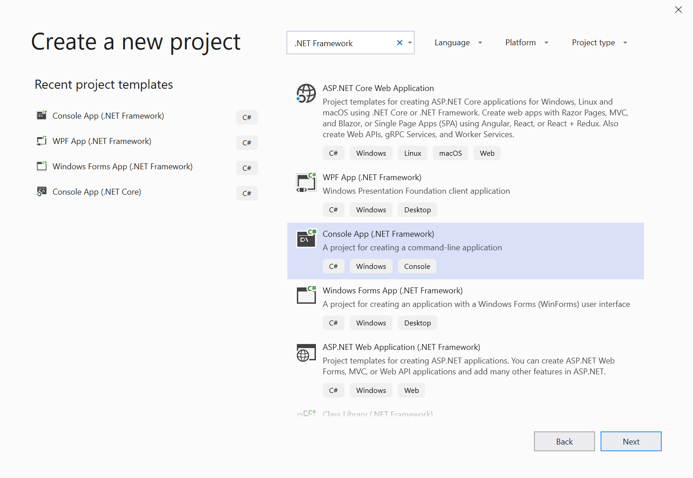

# Automatizar y probar WebView2 con el controlador Microsoft Edge

Puesto que WebView2 usa la plataforma web de cromo, los desarrolladores de WebView2 pueden aprovechar las herramientas de web estándar para la depuración y la automatización. Una de estas herramientas es Selenium, que implementa la API [Webdriver](https://www.w3.org/TR/webdriver2/) W3C, que se puede usar para crear pruebas automatizadas que simulen interacciones del usuario.

Puedes empezar de este modo:

## Paso 1: Descargar ejemplo de WebView2API

Si no tiene un proyecto de WebView2 existente, descargue nuestra [aplicación de ejemplo WebView2API](https://github.com/MicrosoftEdge/WebView2Samples/tree/master/WebView2APISample#webview2-api-sample), una muestra completa del SDK de WebView2 más reciente. Asegúrese de que cumple con estos [requisitos previos](https://github.com/MicrosoftEdge/WebView2Samples/tree/master/WebView2APISample#prerequisites).

Una vez que haya clonado el repositorio, compile el proyecto en Visual Studio. Debería ser similar al siguiente:


## Paso 2: instalar el controlador de Microsoft Edge

Siga las instrucciones para instalar el [controlador Microsoft Edge](https://docs.microsoft.com/microsoft-edge/webdriver-chromium#download-microsoft-edge-driver) el controlador específico del explorador requerido por Selenium para automatizar y probar WebView2.

Es importante asegurarse de que la versión del controlador de Microsoft Edge coincide con la versión de Microsoft Edge que usa la aplicación. Para que el ejemplo WebView2API funcione, asegúrate de que tu versión de Microsoft Edge sea mayor o igual a la versión compatible de nuestra última versión de SDK que se encuentra [en nuestras notas de la versión](https://docs.microsoft.com/microsoft-edge/hosting/webview2/releasenotes). Para averiguar qué versión de Microsoft Edge tiene actualmente, carga `edge://settings/help` en el explorador.

## Paso 3: agregar Selenium al ejemplo WebView2API

En este momento, debe tener Microsoft Edge instalado, haber creado un proyecto WebView2 y el controlador Microsoft Edge instalado. Ahora vamos a empezar a usar Selenium.

> [!NOTE]
> Selenium es compatible con C#, Java, Python, JavaScript y Ruby. Sin embargo, esta guía estará en C#.

1. Para empezar, cree un nuevo proyecto de **C# .NET Framework** en **Visual Studio**. Para continuar, haga clic en **siguiente** en la esquina inferior derecha.



2. Asigne un **nombre**al proyecto, guárdelo en la **Ubicación**que prefiera y haga clic en **crear**.


3. Se creará un nuevo proyecto. En esta guía, todo el código se escribirá en el archivo **Program.CS** .


4. Ahora vamos a agregar **Selenium** al proyecto. Puede instalar Selenium a través del **paquete de NuGet Selenium. WebDrive**.

Para descargar el **paquete de NuGet Selenium. WebDrive**, en **Visual Studio**, mantenga el mouse sobre **Project** y seleccione **administrar paquete de Nuget**. Debe aparecer la siguiente pantalla:


5. Escriba **Selenium. WebDrive** en la barra de búsqueda, haga clic en **Selenium. WebDrive** desde los resultados y asegúrese de que marca la casilla junto a **incluir versión preliminar**. En la ventana de la derecha, asegúrese de que la **versión** está configurada para **instalar 4.0.0-alpha04** o posterior y haga clic en **instalar**. Nuget descargará Selenium en su equipo.

[Más información sobre el paquete NuGet Selenium. WebDrive.](https://www.nuget.org/packages/Selenium.WebDriver/4.0.0-alpha04)


6. Para usar **OpenQA. Selenium. Edge** , agrega la siguiente instrucción: ```using OpenQA.Selenium.Edge;``` al principio de **Program.CS**

```csharp
using OpenQA.Selenium.Edge;

using System;
using System.Collections.Generic;
using System.Linq;
using System.Text;
using System.Threading.Tasks;
```

## Paso 4: unidad WebView2 con Selenium y Microsoft EdgeDriver

1. En primer lugar, cree el `EdgeOptions` objeto copiando el código siguiente:

```csharp
static void Main(string[] args)
{
    // EdgeOptions() requires using OpenQA.Selenium.Edge
    // Construct EdgeOptions with is_legacy = false and the string "webview2"
    EdgeOptions edgeOptions = new EdgeOptions(false, "webview2");
```

El `EdgeOptions` objeto toma dos parámetros:
\
    **Los**
    1. `is_legacy`: set to `false` , que indica a Selenium que estás conduciendo al nuevo navegador Microsoft Edge basado en cromo.
    2. `"webview2"`: una cadena que indica Selenium estás **WebView2**

2. A continuación, establezca `edgeOptions.BinaryLocation` la ruta de acceso del archivo ejecutable de su proyecto WebView2, cree una cadena llamada `msedgedriverDir` que proporcione la ruta de acceso al archivo en la que instaló el [controlador Microsoft Edge](https://developer.microsoft.com/microsoft-edge/tools/webdriver/#downloads)y cree una cadena llamada `msedgedriverExe` para almacenar el nombre del ejecutable del controlador Microsoft Edge. De forma predeterminada, se llama al ejecutable `"msedgedriver.exe"` . Use estas dos cadenas para construir el `EdgeDriverService` objeto como se muestra a continuación. Por último, cree el `EdgeDriver` objeto con `EdgeDriverService` and `EdgeOptions` .

Puede copiar y pegar el código siguiente debajo `edgeOptions` . Asegúrese de especificar las rutas de archivo correctas para el ejecutable del proyecto y el ejecutable del controlador de Microsoft Edge de su equipo.

```csharp
    //Set the BinaryLocation to the filepath of the WebView2API Sample's executable
    edgeOptions.BinaryLocation = @"C:\path\to\your\webview2\project.exe";

    //Set msedgedriverDir to the filepath of the directory housing msedgedriver.exe
    string msedgedriverDir = @"C:\path\to\your\msededriver.exe's\directory";

    //Set msedgedriverExe to the name of the Edge Driver. By default it is:
    string msedgedriverExe = @"msedgedriver.exe";

    // Construct EdgeDriverService with is_legacy = false  
    EdgeDriverService service = EdgeDriverService.CreateDefaultService(msedgedriverDir, msedgedriverExe, false);

    EdgeDriver e = new EdgeDriver(service, edgeOptions);
```

3. Ahora, **EdgeDriver** está configurado para impulsar la **WebView2** en el proyecto. Por ejemplo, si usas el **ejemplo WebView2API**, puedes **navegar** <https://microsoft.com> por llamadas ```e.Url = @"https://www.microsoft.com";``` . Puede ver **Selenium** Drive **WebView2** configurando un punto de interrupción en esta línea y ejecutando el proyecto.

```csharp
    //The following will Navigate the WebView2API Sample from bing.com to microsoft.com
    e.Url = @"https://www.microsoft.com";

    //This exits the edge driver
    e.Quit();
}
```


¡Enhorabuena! Has automatizado correctamente un proyecto WebView2 y WebView2 controlado con Selenium y el controlador Microsoft Edge.

## Pasos siguientes

Para obtener más información:

- Consulte la [documentación de Selenium](https://www.selenium.dev/documentation/en/webdriver/) para obtener una visión completa de las API Selenium disponibles para conducir WebView2 o Microsoft Edge (cromo).
- Más información sobre el control de [WebView2](https://docs.microsoft.com/microsoft-edge/hosting/webview2) y cómo usarlo al incrustar contenido web en la aplicación nativa
- Consulta la [documentación del controlador de Microsoft Edge](https://docs.microsoft.com/microsoft-edge/webdriver-chromium) para obtener más información sobre cómo automatizar Microsoft Edge (cromo)

## Ponerse en contacto con el equipo de la vista de WebView de Microsoft Edge  

[!INCLUDE [contact WebView team note](../includes/contact-webview-team-note.md)]  
