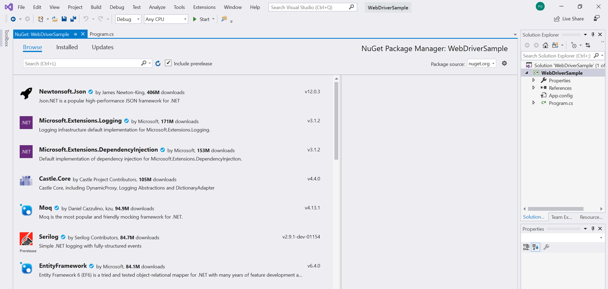

# <span data-ttu-id="e090c-104">Automatizar y probar WebView2 con el controlador Microsoft Edge</span><span class="sxs-lookup"><span data-stu-id="e090c-104">Automating and Testing WebView2 with Microsoft Edge Driver</span></span>

<span data-ttu-id="e090c-105">Puesto que WebView2 usa la plataforma web de cromo, los desarrolladores de WebView2 pueden aprovechar las herramientas de web estándar para la depuración y la automatización.</span><span class="sxs-lookup"><span data-stu-id="e090c-105">Because WebView2 utilizes the Chromium web platform, WebView2 developers can take advantage of standard web tooling for debugging and automation.</span></span> <span data-ttu-id="e090c-106">Una de estas herramientas es Selenium, que implementa la API [Webdriver](https://www.w3.org/TR/webdriver2/) W3C, que se puede usar para crear pruebas automatizadas que simulen interacciones del usuario.</span><span class="sxs-lookup"><span data-stu-id="e090c-106">One such tool is Selenium, which implements the W3C [WebDriver](https://www.w3.org/TR/webdriver2/) API, which can be used to create automated tests that simulate user interactions.</span></span>

<span data-ttu-id="e090c-107">Puedes empezar de este modo:</span><span class="sxs-lookup"><span data-stu-id="e090c-107">Here's how to get started:</span></span>

## <span data-ttu-id="e090c-108">Paso 1: Descargar ejemplo de WebView2API</span><span class="sxs-lookup"><span data-stu-id="e090c-108">Step 1: Download WebView2API Sample</span></span>

<span data-ttu-id="e090c-109">Si no tiene un proyecto de WebView2 existente, descargue nuestra [aplicación de ejemplo WebView2API](https://github.com/MicrosoftEdge/WebView2Samples/tree/master/WebView2APISample#webview2-api-sample), una muestra completa del SDK de WebView2 más reciente.</span><span class="sxs-lookup"><span data-stu-id="e090c-109">If you do not have an existing WebView2 project, download our [WebView2API Sample application](https://github.com/MicrosoftEdge/WebView2Samples/tree/master/WebView2APISample#webview2-api-sample), a comprehensive sample of the latest WebView2 SDK.</span></span> <span data-ttu-id="e090c-110">Asegúrese de que cumple con estos [requisitos previos](https://github.com/MicrosoftEdge/WebView2Samples/tree/master/WebView2APISample#prerequisites).</span><span class="sxs-lookup"><span data-stu-id="e090c-110">Please double check that you have satisfied these [prerequisites](https://github.com/MicrosoftEdge/WebView2Samples/tree/master/WebView2APISample#prerequisites).</span></span>

<span data-ttu-id="e090c-111">Una vez que haya clonado el repositorio, compile el proyecto en Visual Studio.</span><span class="sxs-lookup"><span data-stu-id="e090c-111">Once you have cloned the repo, build the project in Visual Studio.</span></span> <span data-ttu-id="e090c-112">Debería ser similar al siguiente:</span><span class="sxs-lookup"><span data-stu-id="e090c-112">It should look like the following:</span></span>


## <span data-ttu-id="e090c-114">Paso 2: instalar el controlador de Microsoft Edge</span><span class="sxs-lookup"><span data-stu-id="e090c-114">Step 2: Install Microsoft Edge Driver</span></span>

<span data-ttu-id="e090c-115">Siga las instrucciones para instalar el [controlador Microsoft Edge](https://docs.microsoft.com/microsoft-edge/webdriver-chromium#download-microsoft-edge-driver) el controlador específico del explorador requerido por Selenium para automatizar y probar WebView2.</span><span class="sxs-lookup"><span data-stu-id="e090c-115">Follow the instructions to install [Microsoft Edge Driver](https://docs.microsoft.com/microsoft-edge/webdriver-chromium#download-microsoft-edge-driver) the browser-specific driver required by Selenium to automate and test WebView2.</span></span>

<span data-ttu-id="e090c-116">Es importante asegurarse de que la versión del controlador de Microsoft Edge coincide con la versión de Microsoft Edge que usa la aplicación.</span><span class="sxs-lookup"><span data-stu-id="e090c-116">It is important to make sure that the version of Microsoft Edge Driver matches the version of Microsoft Edge that the application uses.</span></span> <span data-ttu-id="e090c-117">Para que el ejemplo WebView2API funcione, asegúrate de que tu versión de Microsoft Edge sea mayor o igual a la versión compatible de nuestra última versión de SDK que se encuentra [en nuestras notas de la versión](https://docs.microsoft.com/microsoft-edge/hosting/webview2/releasenotes).</span><span class="sxs-lookup"><span data-stu-id="e090c-117">For the WebView2API Sample to work, make sure that your version of Microsoft Edge is greater than or equal to the supported version of our latest SDK release found [in our Release Notes](https://docs.microsoft.com/microsoft-edge/hosting/webview2/releasenotes).</span></span> <span data-ttu-id="e090c-118">Para averiguar qué versión de Microsoft Edge tiene actualmente, carga `edge://settings/help` en el explorador.</span><span class="sxs-lookup"><span data-stu-id="e090c-118">To find out what version of Microsoft Edge you currently have, load `edge://settings/help` in the browser.</span></span>

## <span data-ttu-id="e090c-119">Paso 3: agregar Selenium al ejemplo WebView2API</span><span class="sxs-lookup"><span data-stu-id="e090c-119">Step 3: Add Selenium to the WebView2API Sample</span></span>

<span data-ttu-id="e090c-120">En este momento, debe tener Microsoft Edge instalado, haber creado un proyecto WebView2 y el controlador Microsoft Edge instalado.</span><span class="sxs-lookup"><span data-stu-id="e090c-120">At this point you should have Microsoft Edge installed, built a WebView2 project, and installed Microsoft Edge Driver.</span></span> <span data-ttu-id="e090c-121">Ahora vamos a empezar a usar Selenium.</span><span class="sxs-lookup"><span data-stu-id="e090c-121">Now, let's get started using Selenium.</span></span>

> [!NOTE]
> <span data-ttu-id="e090c-122">Selenium es compatible con C#, Java, Python, JavaScript y Ruby.</span><span class="sxs-lookup"><span data-stu-id="e090c-122">Selenium supports C#, Java, Python, Javascript, and Ruby.</span></span> <span data-ttu-id="e090c-123">Sin embargo, esta guía estará en C#.</span><span class="sxs-lookup"><span data-stu-id="e090c-123">However, this guide will be in C#.</span></span>

1. <span data-ttu-id="e090c-124">Para empezar, cree un nuevo proyecto de **C# .NET Framework** en **Visual Studio**.</span><span class="sxs-lookup"><span data-stu-id="e090c-124">Start by creating a new **C# .NET Framework** project in **Visual Studio**.</span></span> <span data-ttu-id="e090c-125">Para continuar, haga clic en **siguiente** en la esquina inferior derecha.</span><span class="sxs-lookup"><span data-stu-id="e090c-125">Click **Next** on the bottom right-hand corner to continue.</span></span>


2. <span data-ttu-id="e090c-127">Asigne un **nombre**al proyecto, guárdelo en la **Ubicación**que prefiera y haga clic en **crear**.</span><span class="sxs-lookup"><span data-stu-id="e090c-127">Give your project a **name**, save it to your preferred **location**, and click **Create**.</span></span>


3. <span data-ttu-id="e090c-129">Se creará un nuevo proyecto.</span><span class="sxs-lookup"><span data-stu-id="e090c-129">A new project will be created.</span></span> <span data-ttu-id="e090c-130">En esta guía, todo el código se escribirá en el archivo **Program.CS** .</span><span class="sxs-lookup"><span data-stu-id="e090c-130">In this guide, all code will be written in the **Program.cs** file.</span></span>


4. <span data-ttu-id="e090c-132">Ahora vamos a agregar **Selenium** al proyecto.</span><span class="sxs-lookup"><span data-stu-id="e090c-132">Now let's add **Selenium** to the project.</span></span> <span data-ttu-id="e090c-133">Puede instalar Selenium a través del **paquete de NuGet Selenium. WebDrive**.</span><span class="sxs-lookup"><span data-stu-id="e090c-133">You can install Selenium via the **Selenium.WebDriver NuGet package**.</span></span>

<span data-ttu-id="e090c-134">Para descargar el **paquete de NuGet Selenium. WebDrive**, en **Visual Studio**, mantenga el mouse sobre **Project** y seleccione **administrar paquete de Nuget**.</span><span class="sxs-lookup"><span data-stu-id="e090c-134">To download the **Selenium.WebDriver NuGet package**, in **Visual Studio**, hover over **Project** and select **Manage NuGet Package**.</span></span> <span data-ttu-id="e090c-135">Debe aparecer la siguiente pantalla:</span><span class="sxs-lookup"><span data-stu-id="e090c-135">The following screen should appear:</span></span>



5. <span data-ttu-id="e090c-137">Escriba **Selenium. WebDrive** en la barra de búsqueda, haga clic en **Selenium. WebDrive** desde los resultados y asegúrese de que marca la casilla junto a **incluir versión preliminar**.</span><span class="sxs-lookup"><span data-stu-id="e090c-137">Enter **Selenium.WebDriver** in the search bar, click **Selenium.WebDriver** from the results, and make sure to checkmark the box next to **include pre-release**.</span></span> <span data-ttu-id="e090c-138">En la ventana de la derecha, asegúrese de que la **versión** está configurada para **instalar 4.0.0-alpha04** o posterior y haga clic en **instalar**.</span><span class="sxs-lookup"><span data-stu-id="e090c-138">On the right-hand side window, ensure the **Version** is set to **install 4.0.0-alpha04** or later and click **Install**.</span></span> <span data-ttu-id="e090c-139">Nuget descargará Selenium en su equipo.</span><span class="sxs-lookup"><span data-stu-id="e090c-139">Nuget will download Selenium to your machine.</span></span>

[<span data-ttu-id="e090c-140">Más información sobre el paquete NuGet Selenium. WebDrive.</span><span class="sxs-lookup"><span data-stu-id="e090c-140">Learn more about the Selenium.WebDriver NuGet package.</span></span>](https://www.nuget.org/packages/Selenium.WebDriver/4.0.0-alpha04)


6. <span data-ttu-id="e090c-142">Para usar **OpenQA. Selenium. Edge** , agrega la siguiente instrucción: ```using OpenQA.Selenium.Edge;``` al principio de **Program.CS**</span><span class="sxs-lookup"><span data-stu-id="e090c-142">Use **OpenQA.Selenium.Edge** by adding the following statement:```using OpenQA.Selenium.Edge;``` at the beginning of **Program.cs**</span></span>

```csharp
using OpenQA.Selenium.Edge;

using System;
using System.Collections.Generic;
using System.Linq;
using System.Text;
using System.Threading.Tasks;
```

## <span data-ttu-id="e090c-143">Paso 4: unidad WebView2 con Selenium y Microsoft EdgeDriver</span><span class="sxs-lookup"><span data-stu-id="e090c-143">Step 4: Drive WebView2 with Selenium and Microsoft EdgeDriver</span></span>

1. <span data-ttu-id="e090c-144">En primer lugar, cree el `EdgeOptions` objeto copiando el código siguiente:</span><span class="sxs-lookup"><span data-stu-id="e090c-144">First, create the `EdgeOptions` object, by copying the code below:</span></span>

```csharp
static void Main(string[] args)
{
    // EdgeOptions() requires using OpenQA.Selenium.Edge
    // Construct EdgeOptions with is_legacy = false and the string "webview2"
    EdgeOptions edgeOptions = new EdgeOptions(false, "webview2");
```

<span data-ttu-id="e090c-145">El `EdgeOptions` objeto toma dos parámetros:</span><span class="sxs-lookup"><span data-stu-id="e090c-145">The `EdgeOptions` object takes in two parameters:</span></span>
\
    **<span data-ttu-id="e090c-146">Los</span><span class="sxs-lookup"><span data-stu-id="e090c-146">Parameters:</span></span>**
    1. `is_legacy`<span data-ttu-id="e090c-147">: set to `false` , que indica a Selenium que estás conduciendo al nuevo navegador Microsoft Edge basado en cromo.</span><span class="sxs-lookup"><span data-stu-id="e090c-147">: set to `false`, which tells Selenium that you are driving the new Chromium-based Microsoft Edge browser.</span></span>
    2. `"webview2"`<span data-ttu-id="e090c-148">: una cadena que indica Selenium estás **WebView2**</span><span class="sxs-lookup"><span data-stu-id="e090c-148">: a string that tell Selenium you are driving **WebView2**</span></span>

2. <span data-ttu-id="e090c-149">A continuación, establezca `edgeOptions.BinaryLocation` la ruta de acceso del archivo ejecutable de su proyecto WebView2, cree una cadena llamada `msedgedriverDir` que proporcione la ruta de acceso al archivo en la que instaló el [controlador Microsoft Edge](https://developer.microsoft.com/microsoft-edge/tools/webdriver/#downloads)y cree una cadena llamada `msedgedriverExe` para almacenar el nombre del ejecutable del controlador Microsoft Edge.</span><span class="sxs-lookup"><span data-stu-id="e090c-149">Next, set `edgeOptions.BinaryLocation` to the file path of your WebView2 project's executable, create a string called `msedgedriverDir` that provides the file path to where you installed [Microsoft Edge Driver](https://developer.microsoft.com/microsoft-edge/tools/webdriver/#downloads), and create a string called `msedgedriverExe` to store the name of the Microsoft Edge Driver executable.</span></span> <span data-ttu-id="e090c-150">De forma predeterminada, se llama al ejecutable `"msedgedriver.exe"` .</span><span class="sxs-lookup"><span data-stu-id="e090c-150">By default, the executable is called `"msedgedriver.exe"`.</span></span> <span data-ttu-id="e090c-151">Use estas dos cadenas para construir el `EdgeDriverService` objeto como se muestra a continuación.</span><span class="sxs-lookup"><span data-stu-id="e090c-151">Use these two strings to construct the `EdgeDriverService` object as shown below.</span></span> <span data-ttu-id="e090c-152">Por último, cree el `EdgeDriver` objeto con `EdgeDriverService` and `EdgeOptions` .</span><span class="sxs-lookup"><span data-stu-id="e090c-152">Finally, create the `EdgeDriver` object using `EdgeDriverService` and `EdgeOptions`.</span></span>

<span data-ttu-id="e090c-153">Puede copiar y pegar el código siguiente debajo `edgeOptions` .</span><span class="sxs-lookup"><span data-stu-id="e090c-153">You can copy and paste the following code underneath `edgeOptions`.</span></span> <span data-ttu-id="e090c-154">Asegúrese de especificar las rutas de archivo correctas para el ejecutable del proyecto y el ejecutable del controlador de Microsoft Edge de su equipo.</span><span class="sxs-lookup"><span data-stu-id="e090c-154">Make sure to specify the correct file paths to your project's executable and the Microsoft Edge Driver's executable on your machine.</span></span>

```csharp
    //Set the BinaryLocation to the filepath of the WebView2API Sample's executable
    edgeOptions.BinaryLocation = @"C:\path\to\your\webview2\project.exe";

    //Set msedgedriverDir to the filepath of the directory housing msedgedriver.exe
    string msedgedriverDir = @"C:\path\to\your\msededriver.exe's\directory";

    //Set msedgedriverExe to the name of the Edge Driver. By default it is:
    string msedgedriverExe = @"msedgedriver.exe";

    // Construct EdgeDriverService with is_legacy = false  
    EdgeDriverService service = EdgeDriverService.CreateDefaultService(msedgedriverDir, msedgedriverExe, false);

    EdgeDriver e = new EdgeDriver(service, edgeOptions);
```

3. <span data-ttu-id="e090c-155">Ahora, **EdgeDriver** está configurado para impulsar la **WebView2** en el proyecto.</span><span class="sxs-lookup"><span data-stu-id="e090c-155">Now, **EdgeDriver** is configured to drive the **WebView2** in your project.</span></span> <span data-ttu-id="e090c-156">Por ejemplo, si usas el **ejemplo WebView2API**, puedes **navegar** <https://microsoft.com> por llamadas ```e.Url = @"https://www.microsoft.com";``` .</span><span class="sxs-lookup"><span data-stu-id="e090c-156">For example, if you are using the **WebView2API Sample**, you can **Navigate** to <https://microsoft.com> by calling ```e.Url = @"https://www.microsoft.com";```.</span></span> <span data-ttu-id="e090c-157">Puede ver **Selenium** Drive **WebView2** configurando un punto de interrupción en esta línea y ejecutando el proyecto.</span><span class="sxs-lookup"><span data-stu-id="e090c-157">You can watch **Selenium** drive **WebView2** by setting a breakpoint on this line and running the project.</span></span>

```csharp
    //The following will Navigate the WebView2API Sample from bing.com to microsoft.com
    e.Url = @"https://www.microsoft.com";

    //This exits the edge driver
    e.Quit();
}
```


<span data-ttu-id="e090c-159">¡Enhorabuena!</span><span class="sxs-lookup"><span data-stu-id="e090c-159">Congratulations!</span></span> <span data-ttu-id="e090c-160">Has automatizado correctamente un proyecto WebView2 y WebView2 controlado con Selenium y el controlador Microsoft Edge.</span><span class="sxs-lookup"><span data-stu-id="e090c-160">You have successfully automated a WebView2 project and driven WebView2 using Selenium and Microsoft Edge Driver.</span></span>

## <span data-ttu-id="e090c-161">Pasos siguientes</span><span class="sxs-lookup"><span data-stu-id="e090c-161">Next Steps</span></span>

<span data-ttu-id="e090c-162">Para obtener más información:</span><span class="sxs-lookup"><span data-stu-id="e090c-162">To learn more:</span></span>

- <span data-ttu-id="e090c-163">Consulte la [documentación de Selenium](https://www.selenium.dev/documentation/en/webdriver/) para obtener una visión completa de las API Selenium disponibles para conducir WebView2 o Microsoft Edge (cromo).</span><span class="sxs-lookup"><span data-stu-id="e090c-163">Check out [Selenium's documentation](https://www.selenium.dev/documentation/en/webdriver/) for a comprehensive look at the APIs Selenium has available for driving WebView2 or Microsoft Edge (Chromium)</span></span>
- <span data-ttu-id="e090c-164">Más información sobre el control de [WebView2](https://docs.microsoft.com/microsoft-edge/hosting/webview2) y cómo usarlo al incrustar contenido web en la aplicación nativa</span><span class="sxs-lookup"><span data-stu-id="e090c-164">Learn more about [WebView2](https://docs.microsoft.com/microsoft-edge/hosting/webview2) control and how to use it when embedding web content in your native app</span></span>
- <span data-ttu-id="e090c-165">Consulta la [documentación del controlador de Microsoft Edge](https://docs.microsoft.com/microsoft-edge/webdriver-chromium) para obtener más información sobre cómo automatizar Microsoft Edge (cromo)</span><span class="sxs-lookup"><span data-stu-id="e090c-165">Check out [documentation for Microsoft Edge Driver](https://docs.microsoft.com/microsoft-edge/webdriver-chromium) to learn more about automating Microsoft Edge (Chromium)</span></span>

## <span data-ttu-id="e090c-166">Ponerse en contacto con el equipo de WebView2</span><span class="sxs-lookup"><span data-stu-id="e090c-166">Getting in touch with the WebView2 team</span></span>  

<span data-ttu-id="e090c-167">Ayúdanos a crear una experiencia WebView2 más rica compartiendo tus comentarios.</span><span class="sxs-lookup"><span data-stu-id="e090c-167">Help us build a richer WebView2 experience by sharing your feedback!</span></span> <span data-ttu-id="e090c-168">Visita nuestro [repositorio de comentarios](https://github.com/MicrosoftEdge/WebViewFeedback) para enviar solicitudes de características o informes de errores, o para buscar problemas conocidos.</span><span class="sxs-lookup"><span data-stu-id="e090c-168">Visit our [feedback repo](https://github.com/MicrosoftEdge/WebViewFeedback) to submit feature requests or bug reports or to search for known issues.</span></span>
